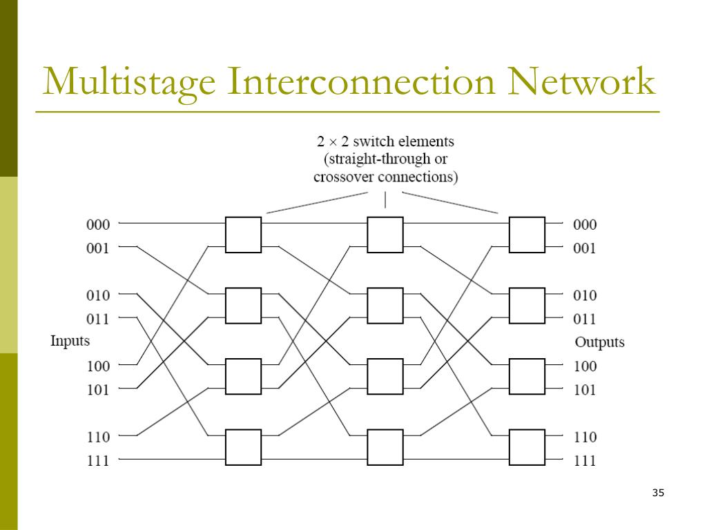

#### RAID

The full name of RAID is 'redundant array of inexpensive disk'.

#### RAID 1
The disk are fully duplicated onto its 'mirror'.
Its effect is to recovery the data which misses in an unexpected way.

#### RAID 3
We have a new disk called 'parity disk' which is used of recovering the data.
When the data in the former disk is missing, we can recover the data by add the other data in the disk to calculate the missing data.
But this method can't recover the data when two disk is failed.
And it can't read or write two disk in the same time.

#### RAID 4
Every sector in the disk has a parity which is called 'self parity'.
It supports small read, but it still only supports large write.

#### RAID 5
It supports small write by the following method.
It has interleaved parity which means two parity are in different disks and we modify the parity by $P'=P+D'-D$, so we needn't to read all the disk.

#### A little queuing theory
$Length_{server} = rate \times Time_{server}$

#### Interconnection
We define a (n,k) cube is a hybercube with n dimensions and k nodes in every dimension.

The diameter is defined as the maximum of two node's distance(the number of link between them).

It is easy to know that if the same node has the least diameter, then its dimension is the most.

#### multi-stage interconnection network

It solves the problem that the node has too many degree in n cube.