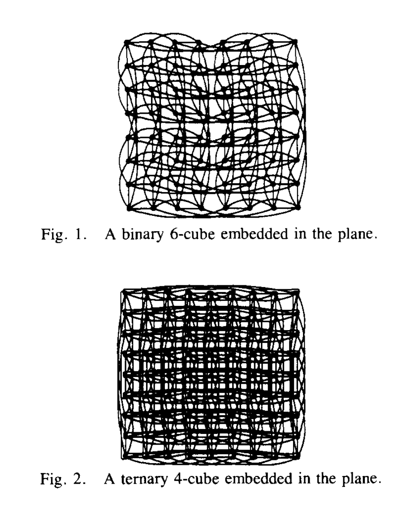
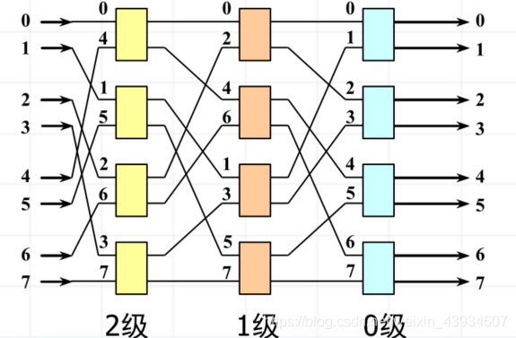

### RAID

What is RAID?

Its full name is `redundant array of inexpensive disks` by Daivid Patterson.

What is redundancy ? 
> Redundancy – Redundancy refers to having numerous components which offer the same function, so that the system functioning can continue in the event of partial system failure.

- small disks are striped together.
    - A single stripe can be viewed as a single large disk.
- high data availability.
    - Even some conponents fail, the service is still available.
- `capacity` and `bandwidth` are increased.

##### RAID 1 : disk mirroring/shadowing
- data fully duplicated on two disks
- drawback: bandiwdth is halved, which means one logic write requires two physical writes.

##### RAID 3 : parity disks

- logic record is split into two parts: data and parity.
- parity records sum of other disks per stripe mod 2.
- if disk fails, we can find the missing data by parity.

**drawbacks**
- Two disk failures can't be found.
- RAID 3 relies on the parity disk, so it can't read or write two disks at the same time.

##### RAID 4 : block-level striping with dedicated parity
- Each disk has a parity : self parity. 
- Small read , large write.

##### RAID 5 : block-level striping with interleaved parity

How to solve small writes (write to one disk) problem in RAID 4?

- option 1 : read other data disks, create new sum and write to parity disk.
- option 2 : since P has old sum, we can get new P by the equation $P' \oplus P = D_x' \oplus D_x$.

Apparently, option 2 is better.

How to solve two disk can't be written at the same time? 

**interleaved parity** : two disks' parity disks are interleaved(in different stripe), so we can access them at the same time.

### A Little Queuing Theory

From the stories of Alei's daily phone call and Macdonald's door watching, we can get the famous **Little's Law**:

$$
L_{ength} = rater \times Time_{server}
$$

### Interconnection Networks

##### Hypercube

An (n,k) cube is a hypercube with n dimensions and k nodes in each dimension.

The distance betwwen two nodes is defined as the number of hops in the shortest path between them.

- When the number of nodes is fixed, as the dimension increases, the distance of the longest path decreases.
- However, the number of links increases.

##### Multi-stage Interconnection Networks

**omega network** : a multi-stage interconnection network with $2^k$ nodes in each stage.

