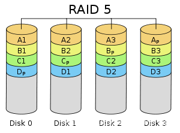

# Topic: RAID
RAID(Redundant Array of Indepedent Disks) is a system of disk matrix designed for large capacity, good performance and high reliability.

### **Key Tech**
1. Data Stripping  
Data stripping can be understand as memory banks. Both of which use multiple blocks in order to improve I/O speed because continuous I/O can be done in different blocks in parallel.
2. Data Validation  
Data validation is used to garanteen the correctness of data and can recover damaged data in certain circumstances. In practice, data validation is usually implemented in two ways: Block Check Characte (BCC)$^1$ and Hamming Code $^2$. Both ways use additional data to store validation information in disks thus requiring additional disk storage. When we write information, the corresponding validation information also requires updation.

### **RAID Rank**
1. RAID0  
RAID0 is a simple structure with data stripping but without data validation. Such structure provides high speed but poor data protection. When data is lost, it shall not be recovered.    
 )
2. RAID1  
RAID1 is also called mirroring. It write identical data into working disk and mirror disk. When data in woriking disk is damaged, it can be retrieved in mirror disk. RAID1 provides high level of data security, but is very expensive since only half of the disks are used.  
 )

3. RAID3 RAID4  
RAID2 uses the technology of Block Check Characte. The validation information is kept in a seperate disks which records the xor result of the corresponding blocks in different disks.   
) )

4. RAID5  
RAID5 is an optimation from RAID4. In RAID3 and RAID4 all validation data are stored in one disk. In writing procedure, one must correct the disk along with the validation disk which forces that writng in different disks have to be executed in parallel since they all need to rewrite validation disk. To overcome such bottleneck, RAID5 employs the design of distributing all validation data in all disks as shown in the illustration below. When we exercise writes on different disks, there can be chances that the validation data corresponding to two strips are in different blocks. In this way, two writes can be executed at the same time.

   

*1. <https://blog.csdn.net/qq_45080064/article/details/118793849>*  
*2. <https://blog.csdn.net/interestANd/article/details/115606013>*

   
# Topic: Little's Law
Little’s Law is a theorem that determines the average number of items in a stationary queuing system, based on the average waiting time of an item within a system and the average number of items arriving at the system per unit of time.  
$$L=\lambda S$$
   
 # Topic: Interconnection(NoP)
 ### Basic concept in topology  
Node degree: the number of links between a node and its neighbors.  
Network diameter: The maximum length of the shortest path between any two nodes in the network is linearly proportional to the communication delay of the network.  
Average shortest distance: the ratio of the sum of the minimum distance between any two IP nodes in the network to the number of paths contained in the sum.
### Possible models 
- hypercube
- mesh
- ring
- dynamic network  
 **...**

 For for information, read  
   <https://blog.csdn.net/weixin_41561691/article/details/104649688>  
   <https://zhuanlan.zhihu.com/p/93409326>