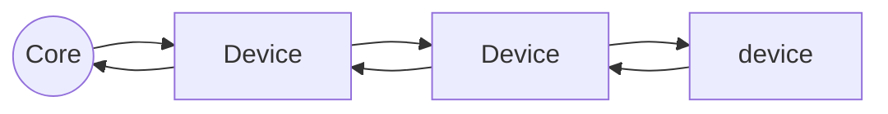

# Note for W7D1

*Authored by Liu Yi-Yu*

Async v.s. Sync
- Interruption (I/O)
- Internet
  - ATM/IDSM (Euro)
  - TCP/IP (USA)

## Interruption

Outer devices interrupt CPU

Using Daisy chain to access:

## Internet
Using supercube to reduce the distance

### ATM/ISDN (Euro)

ATM: Async Transfer Mode

- virtual circuit (the circuit using switch)

- Have full access to the virtual circuit if the connection has been established

- slice the data into pieces to avoid data loss

### TCP/IP (USA)

Using the asynchronous network to implement a synchronous network

### Internet Service
- SNMP (know the state of every node)
- OSPF (larger scale)
- DNS (the largest scale)

Most thing in internet is implemented in user space instead of kernel space

### CDMA (1989)
- Frequent Hopping Spread Spectrum
- Direct Sequence Spread Spectrum
- Orthogonal coding
