# Arch Note W10 D2

> written by Yang Jin-cheng

## Async v.s. Sync

> async technique
> 
> H/W done by interruption
> 
> S/W done by call

+ Interruption I/O

+ Internet 
  
  + ATM (async transfer mode) / ISDN model
    
    ATM is widely used in the US
    
    ISDN is mainly used in the Euro

### Intel's Solution for H/W Interruption

8086: central controller

8259: interruption controller

INT: external device tell core to stall and switch I/O port (a unilateral signal)

IC design: handle INT signals, can be multi-stage

### Modern Solution for H/W Interruption

#### APIC

APIC: advanced programmable IC

signal path: I/O device -> bus -> APIC -> core

#### Daisy Chain

rely other I/O devices on INT signal transmission

relatively slow but highly scalable 

#### Internet Async Solution

+ MIN: multi-stage interchange network (faster)
  
  O(nlogn) time complexity in data interchange

+ SDN: software defined network (slower)
  
  better robust and scalability

+ ISDN: intergrade service digital network
  
  VC (virtual connection) technique
  
  use telephone network (sync) for internet transformation (async)

+ TCP/IP: devide data into packages (better robust) 
