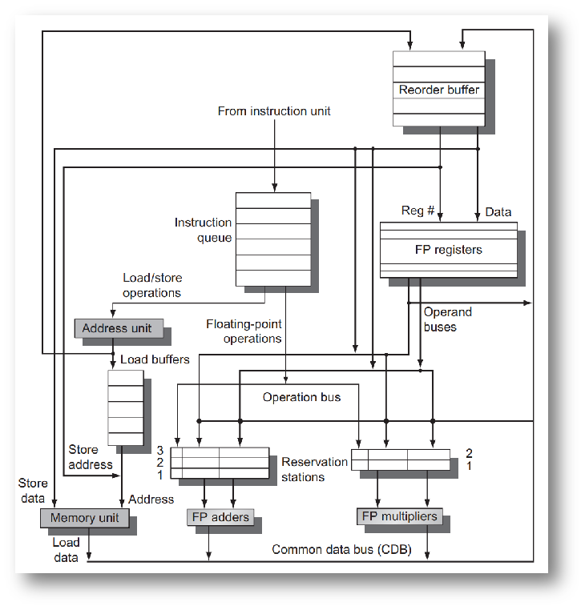

### Tomasulo

思想：renaming

RS：

四个阶段：

- Issue：获取指令，向 RS 和 ROB 发送信号
- Execution： 从 RS 中取出可以执行的指令并执行。还不能执行的指令试图从 CDB 中获取数据。
- Write Back：将数据写入CDB，将数据提供给 RS 和 ROB，将 RS 中的位置标记为可用。
- Commit：ROB 中按顺序提交指令，修改寄存器的值。

优势：消除了 WAW 和 WAR 的影响

### 中断

- 精确中断(precise Interrupt)
  - 所有该指令之前的指令都已经提交其状态
  - 所有后续指令（包括中断的指令）没有改变任何机器的状态
- 非精确中断(Non-precise interrupt)
  - 直接截断所有流水中的指令，需要程序员自行处理

实现精确中断：ROB