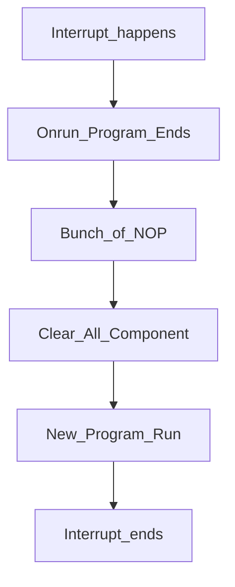

# W11D1

## Tomasulo Design

## Basic Design

略

## Exceptions

What's exception?

From Software to stop CPU:Exception

From IO to stop CPU:Interrupt

According to Alei,normally only Page Fault Exception is tolerated by the OS.

#### Context Switch:

#### How to Rerun the program after interrupt?
**Precise Interrupt**:

When Interrupt Happens on some Fixed instruction,the architecture guarantees that every instruction **before** it is done, while every instrction **after** it uncommited.

This job is easily done,thanks to Reorder Buffer(ROB or 重排序缓冲区).

剩下的就是阿磊老师漫谈历史时间🕶️

