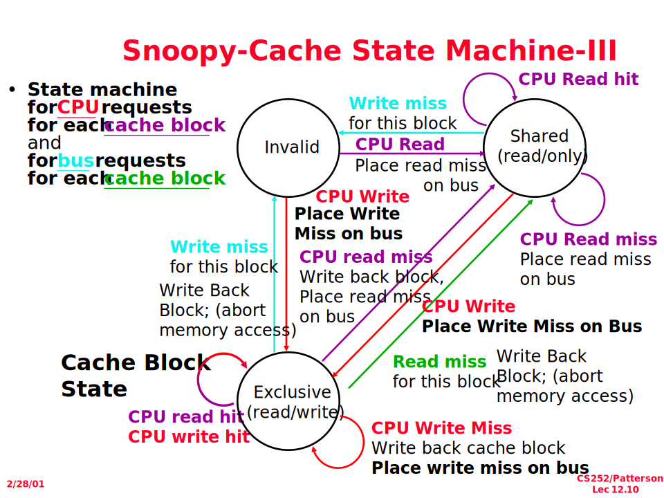

# W12D1 Notes

林田川  2022.11.28

## Review: Out-of-Order

- Dynamic: Tomasulo + ROB
- Static: via Code Movement

## Distributed Computing System

- Example Problem: Coherence vs. Consistency
  - Snoopy Protocol
  - Directory-based
- SMP (Shared Memory Processing / Symmetric Multi-Processor) / Cluster / Grid / Cloud {SaaS, PaaS, IaaS} (Software, Platform, Infrastructure)

### Snoopy Protocol

Cache 之间：Non-Coherence
Cache 与 Memory 不一致：inconsistency

改进版：MESI
Modified Exclusive Share Invalid
