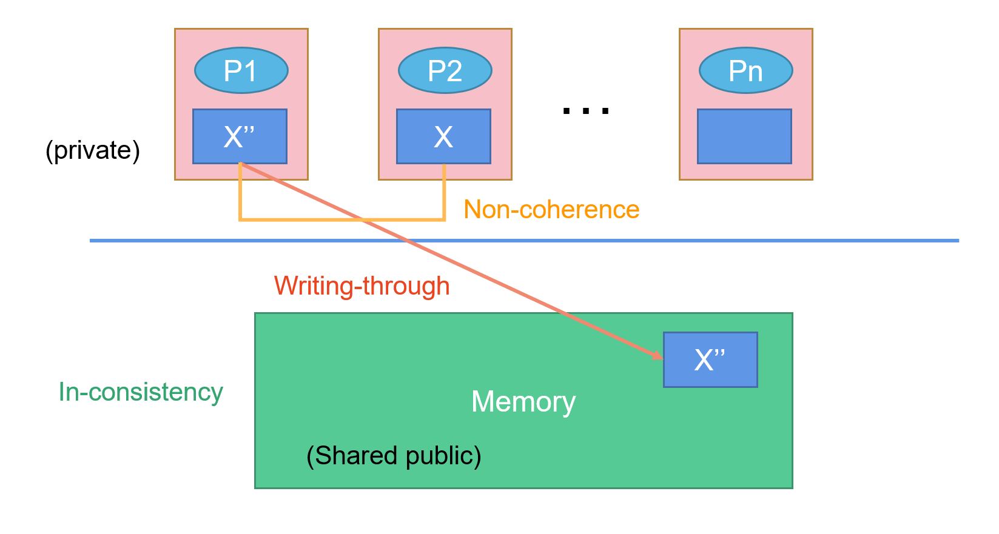
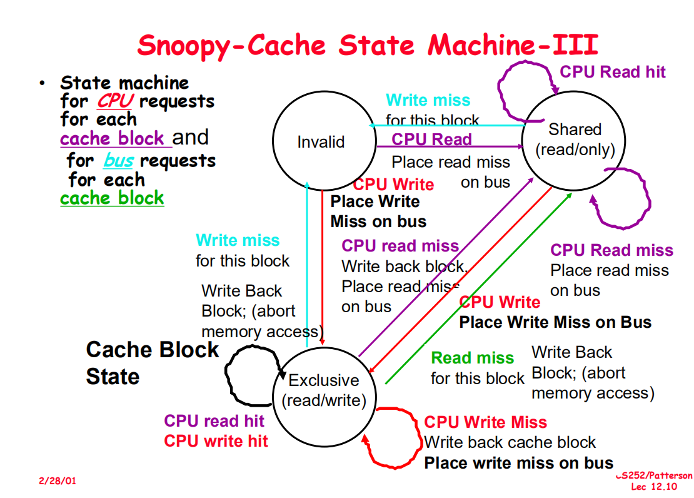
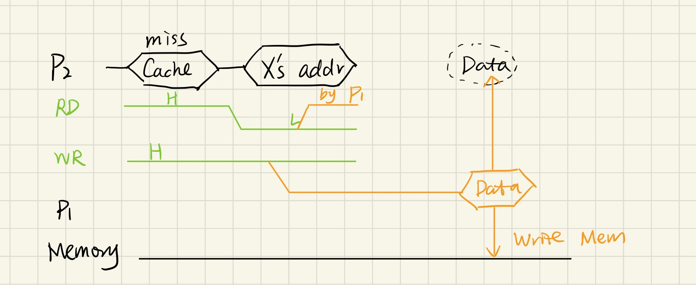
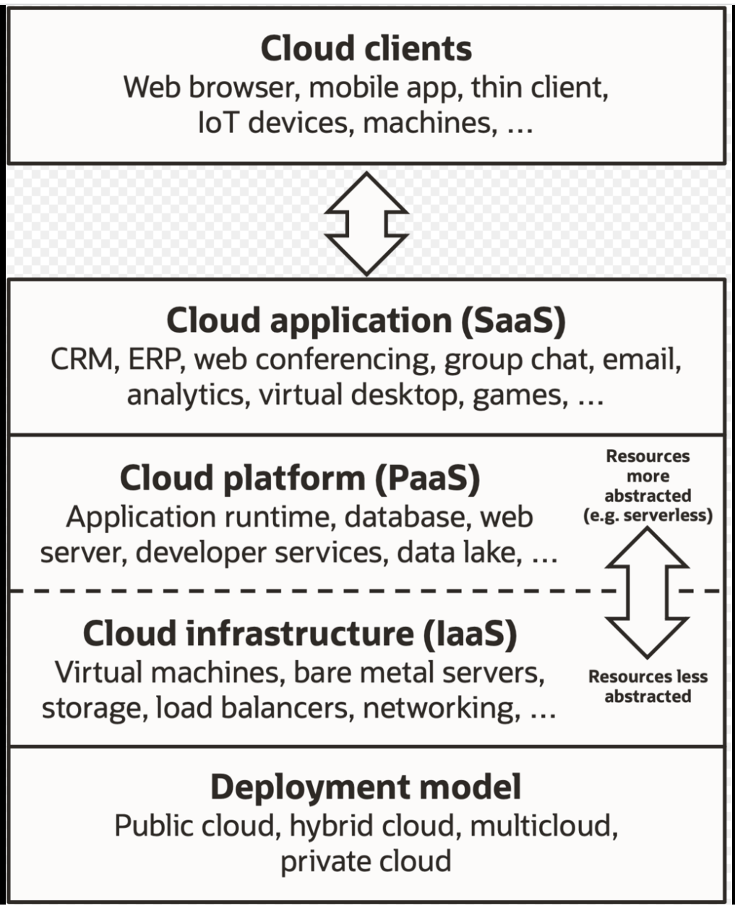

#### Review: Out-of-Order

- Dynamic: $Tomasulo$
- Static: ( via code movement ) 在编译阶段，调整顺序，防止冲突

#### Distributed Computing System

- Example Problem: Snoopy Protocol（总线监听协议）
- Coherence （分布式） vs. Consistency（集中式）

$SMP$ (Symmetrical Multi-Processing)



#### Coherence

主要内容：Lecture 12

- Snoopy（snoop：窥探，调查）

  - Invalid：某个数据有修改后，全部有该数据的地方的 $valid$ 位都改为 $invalid$

- Directory-based

#### 主要任务：看懂这张图

一篇写的还挺清楚的知乎：

笔记：CPU中的cache（四） - Robinson的文章 - 知乎 https://zhuanlan.zhihu.com/p/145049266



##### Exclusive：

假设有人拥有，并只有它拥有最新的数据，那它处于 exclusive 状态，此时 memory 还没有最新的数据，当有人要访问这个数据，

exclusive 听到后，就会发出 read miss，使得 memory 听不到这个访问，abort 掉，并把它拥有的唯一新数据写回memory，并将自己的数据返回给想要这个数据的人，下一步变成 shared 状态。

技术上如图：



##### Shared：

如果 memory 有两个数据 x,y，假设 x,y 的映射都是同一行，此时x在cache中，read y miss了，这时只要把 y 读过来就行了，因此转一圈依旧回到 shared 状态。

##### Invalid：

exclusive 有 x'，shared状态有 x，有人拥有了最新的 x’‘，此时 exclusive 状态和 shared 状态都过时了，都转变为 Invalid状态。

把所有旧的都写回memory，包括 x',x，但是 x' ,x 的写回 memory 的过程会被 write miss abort 掉。

#### Consistency Problem

$P_i$ 程序

```
a=0;
...
a=1;
if(b==0)then
```

$P_j$ 程序

```
b=0;
...
b=1;
if(a==0)then
```

Q: both `a==0` & `b==0` （在 $P_i$ 和 $P_j$ 同时跑的情况下）

#### 一些概念

- $SMP$ / Cluster / Grid / Cloud

  - **SMP**：对称多处理"（Symmetrical Multi-Processing）简称 SMP

    是指在一个计算机上汇集了一组处理器(多CPU)，各CPU之间共享内存子系统以及总线结构。

  - **Cluster：**

    简单的说，集群(cluster)就是一组计算机，它们作为一个总体向用户提供一组网络资源。这些单个的计算机系统就是集群的节点(node)。一个理想的集群是，用户看来，集群是一个系统，而非多个计算机系统。而且集群系统的管理员能够任意添加和删改集群系统的节点。

  - **Grid**（格网计算）是一种新的高性能的分布式计算方法。

    格网计算作为新一代的分布式计算方法，有集中管理，比如要加入某某grid才行

  - **Cloud：**

    也是一种分布式计算方法，里面没有集中管理

- Cloud Computing

  - $SaaS$（Software as a Service）

  - $PaaS$（Platform as a Service）

  - $IaaS$（Infrastructure as a Service）

    