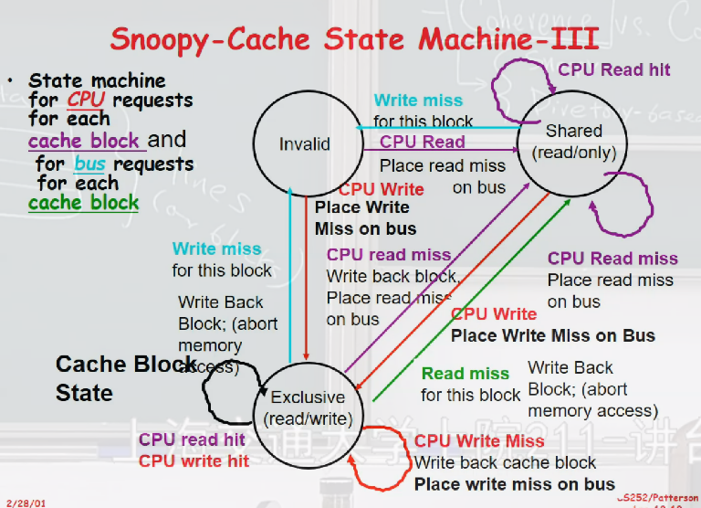

## 11.28 notes

### Distributed Computing System

- Example Problem: Snoopy Protocal
- Key: Coherence vs. Consistency

考虑 SMP 架构：多个处理器拥有自己的 Cache，共用一块内存.

#### SMP 架构下的 Coherence 问题:

解决方案：

- snoopy coherence 协议（分布式）（监听）
- Diretory-based（集中式）

考虑 snoopy protocols 方案

1. invalidate

将别处修改过的的数据作废

> 将 valid 位设为 false 即可，不需要改动数据

example: **MESI(Modified Exclusive Shared Invalid) 协议**

状态机基于这种方案.

2. broadcast

将数据改成 x' （改动后的数据）

若修改数据，为保证原子性需要等待所有数据修改完，故效率可能不如 invalidate 高，故 invalidate 更常用。