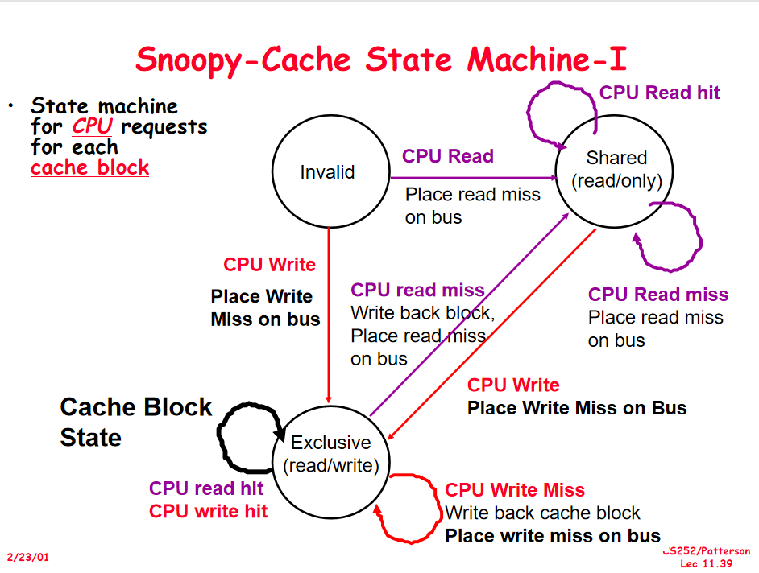
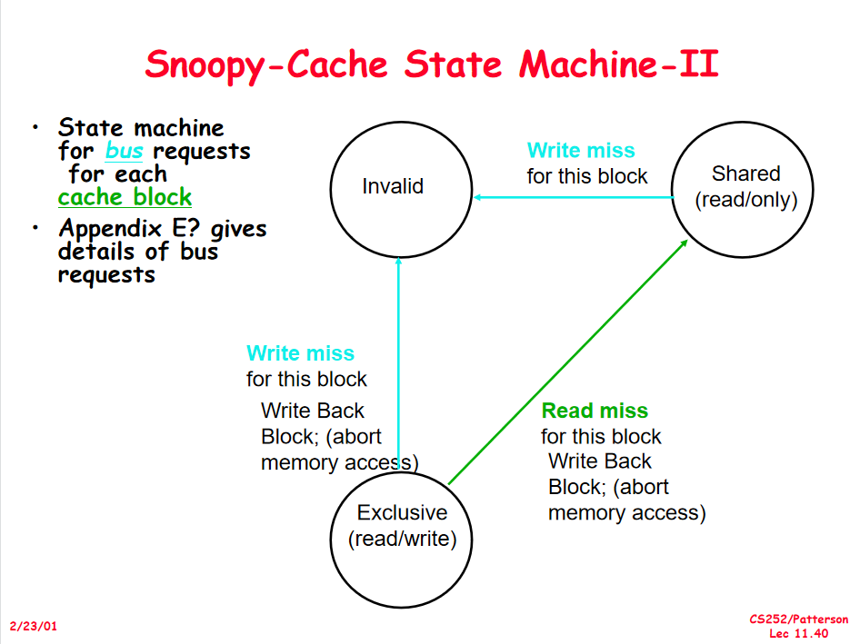
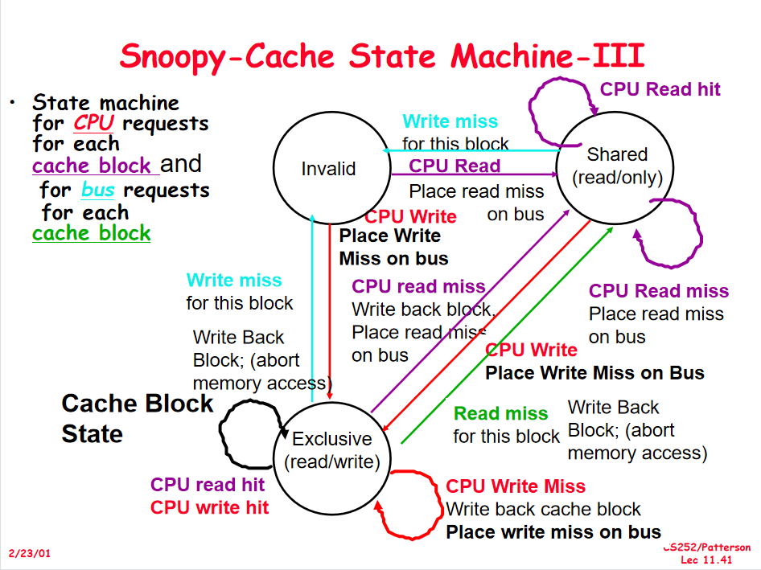
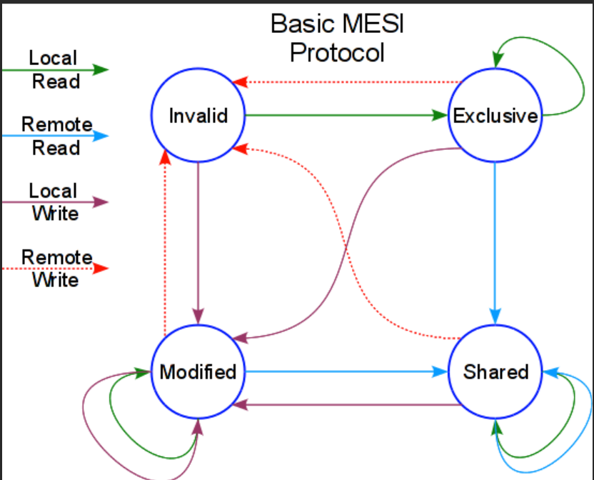

# Note W12D2

> 主要上课内容：内存一致性协议：ESI， MESI

## Snoopy 协议：

### ESI：

每个 L1 Cache 分为三种状态： `E(Exclusive)` , `S(Shared)` , `I(Invalid)` 。初始都是 `Invalid` 状态.

#### 三种状态的解释：

- `Exclusive` : 数据经过了修改，在此 cache 中是 dirty 的。
- `Shared` : 数据是 up to date 的。
- `Invalid` : 当前 cache 中没有数据。

#### 三种状态的装换：

##### 根据从 CPU 来的请求转换状态：

##### 根据来自 总线 的信息转换状态：

##### 合并：

### MESI:

增加状态 `M(Modify)` . 如果修改 modify 状态的 cache 将不会进行核间通信，这也是 MESI 相对于 ESI 的优点。

#### 状态转换图：

