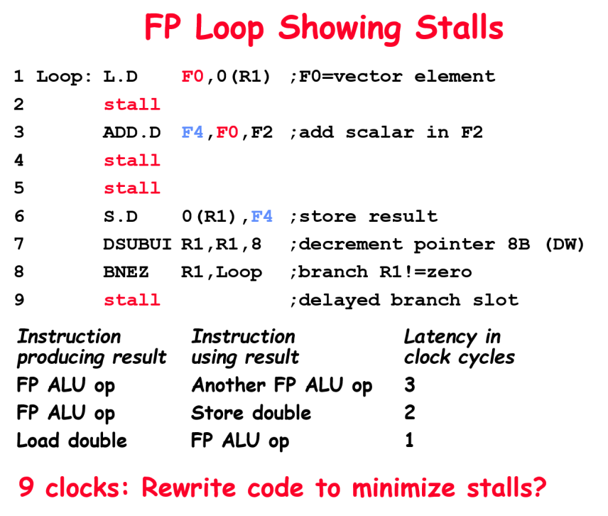
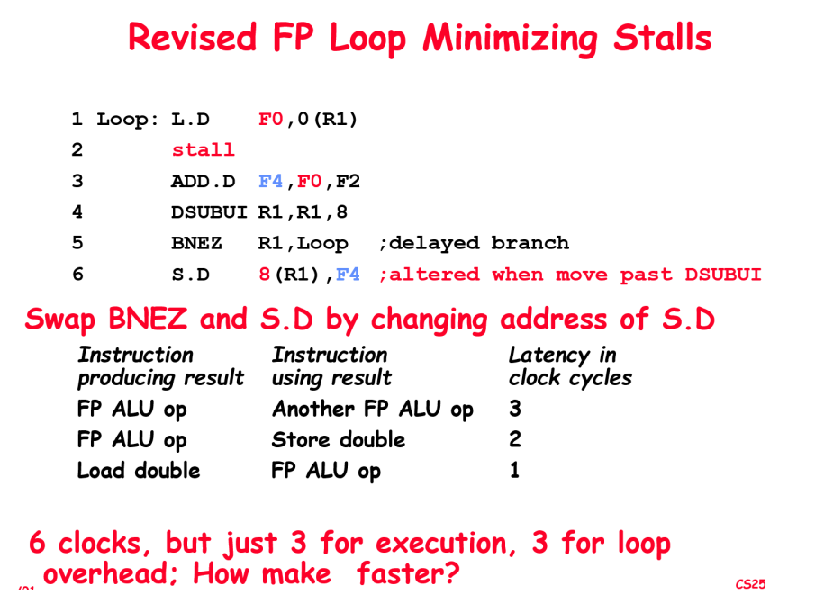
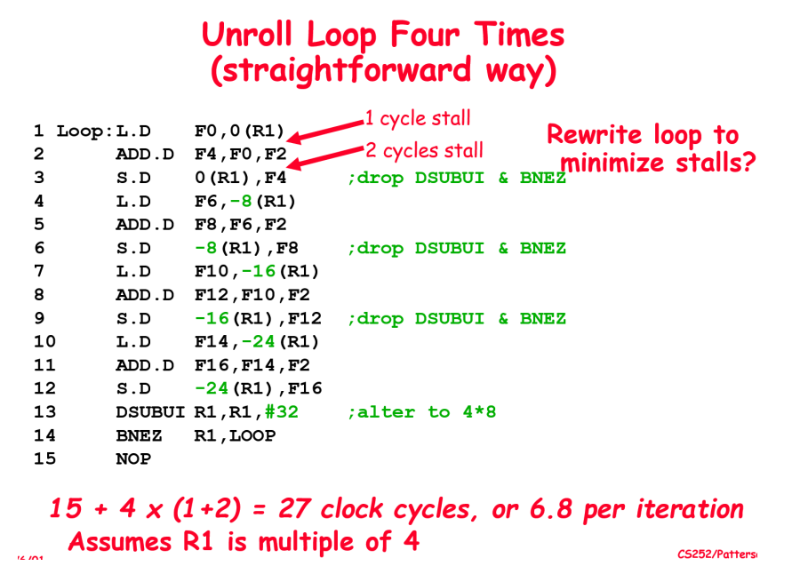
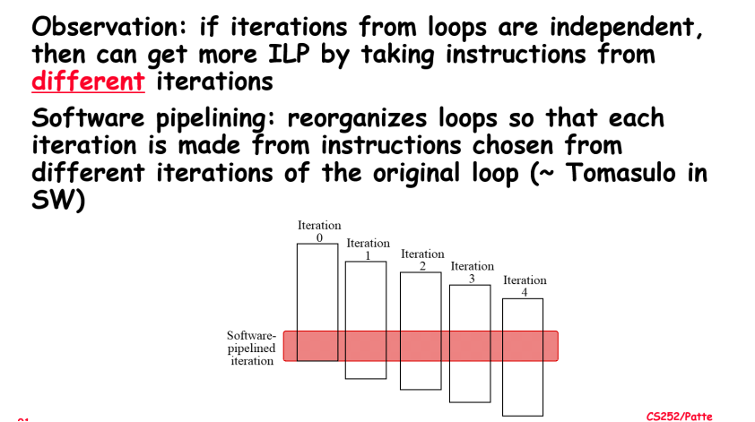
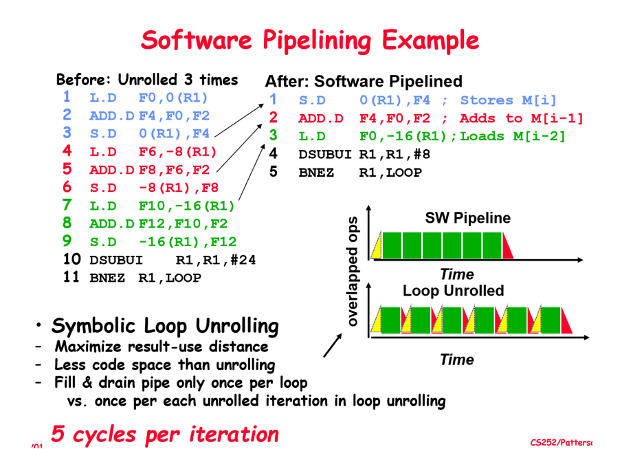

## Unrolling (for loop)(simple)

循环展开

我们把 Loop 中跳转到开头label的代码块称为 loop overhead（7-8-...），中间的部分称为 payload（1-6）

设 $t_{payload} = t_1, t_{overhead}=t_2$，循环次数为 n

- 未展开，$T = n*(t_1+t_2)$
- 展开了其中的 s 次（$s<=n$），$T'=n*t_1+(n/s)*t_2$

> R1 实际上是一个指针，值为地址，8(R1) 表示 地址= R1+8 对应的值(`*(R1+8)`)

优化1：调换顺序，把 store 指令放在 branch 后面，减小 payload

优化2：循环展开，减少了 loop overhead

缺点：

1. 需要中间寄存器进行数据传递
2. 代码大量膨胀

必须保证每段代码没有相关性。(但是某些情况下，有可能能够实现 unroll)

## Software pipeline

如何实现？先 手动 unrolling，然后判断哪些指令可以同时执行

实现顺序恰好颠倒。目的：让同色的指令之间间隔尽量大

## 在编译时，硬件如何支持并行（Parallelism）

### Dual issue（双发射）

一个处理器在一个 cycle 内可以同时 fetch/decode 2条指令

- 需要有两个 fetcher/decoder
- 目标：尽量让每个 function unit 都保持 busy 状态

- 可以将指令合并(如：可以把 BEQZ 和 LW 合并成 LWC 指令)(避免 waste)

- 为什么要短的指令才可以替换？长指令的执行时间不能被忽略，要谨慎处理

### super scalar（多路径）

一个部件在一个时刻可以处理多个 **数据** 

## VLIW（Very Long Instruction Word，超长指令字）

History：

1. TI-DSP，为了实现矩阵乘法，把操作数变长
2. 通用处理器，把可以同时 issue 的指令合并成一个长条

