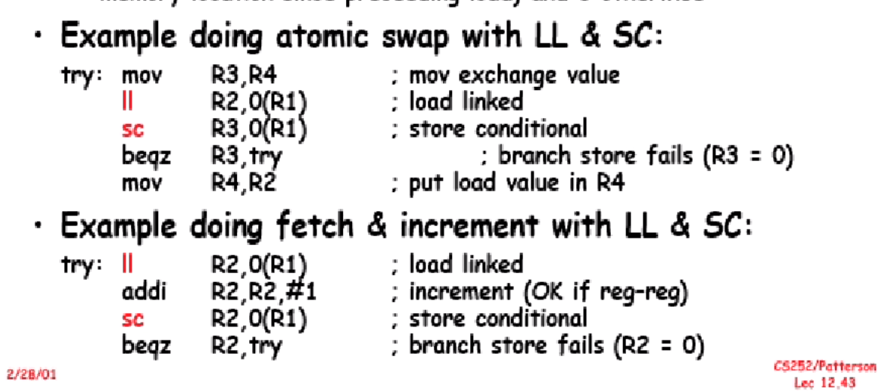
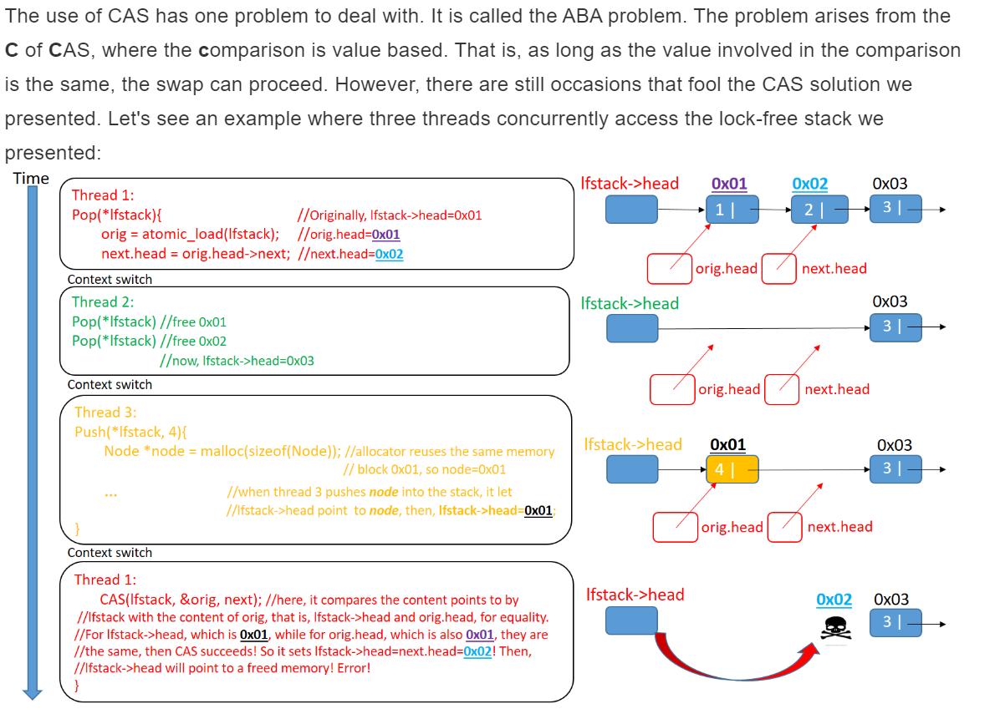

# Topic: Load-linked/store-conditional（LL/SC)
### Definition:  
In computer science, load-linked/store-conditional (LL/SC) are a pair of instructions used in multithreading to achieve synchronization. Load-link returns the current value of a memory location, while a subsequent store-conditional to the same memory location will store a new value only if no updates have occurred to that location since the load-link. Together, this implements a lock-free atomic read-modify-write operation.  
### Need:
When we try to update a value, we first need to read it into the registers and then modify the value in registers then return the value to our memory. In that process, the value of the original data in the memory is possibly modified by other operators. When we rewtite out value, we overlap the other modification. Thus, we need a protocol to avoid that.   
### Example:

The ll/sc operations in the code we give don't have a solid way of implemetation, they only give general idea. The ll operation will use a sort of tag to track any modification on the memory that it read. If in sc operation, we know that the memory has been touched, we abandon current result and redo the operation of ll/sc.

### CAS(Compare and Swap)  
In computer science, compare-and-swap (CAS) is an atomic instruction used in multithreading to achieve synchronization. It compares the contents of a memory location with a given value and, only if they are the same, modifies the contents of that memory location to a new given value. This is done as a single atomic operation. The atomicity guarantees that the new value is calculated based on up-to-date information; if the value had been updated by another thread in the meantime, the write would fail. The result of the operation must indicate whether it performed the substitution; this can be done either with a simple boolean response (this variant is often called compare-and-set), or by returning the value read from the memory location (not the value written to it).

### ABA Problem

### Comparason: LL/SC versus CAS
- If any updates have occurred, the store-conditional is guaranteed to fail, even if the value read by the load-link has since been restored. As such, an LL/SC pair is stronger than a read followed by a compare-and-swap (CAS), which will not detect updates if the old value has been restored.  
- Real implementations of LL/SC do not always succeed even if there are no concurrent updates to the memory location in question. Any exceptional events between the two operations, such as a context switch, another load-link, or even (on many platforms) another load or store operation, will cause the store-conditional to spuriously fail. Older implementations will fail if there are any updates broadcast over the memory bus. This is called weak LL/SC by researchers, as it breaks many theoretical LL/SC algorithms. Weakness is relative, and some weak implementations can be used for some algorithms.

