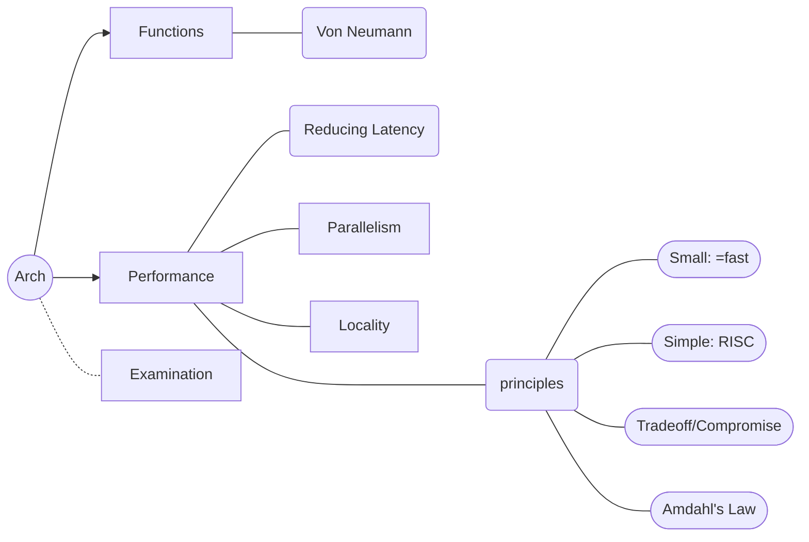

# Review

## Functions
Von Neumann's architecture

## Performance
CPI (clock per instruction)
### Reduce Latency
- higher frequency
- CLA

### Principles
- Small (=fast)
- Simple (RISC)
- Tradeoff/Compromise
- Amdahl's Law: make the most common fast. ($\displaystyle s_p=\frac{1}{(1-n)+n/s}$)

## Pipeline

### Basic Principle
- Balance
- Speed up

### Hazard
$\approx$ stalls

#### Structural
Duplicating

Example:

memory conflict

- ID's 4th stage
- Ii's 1st stage

Solution: I-Cache / D-Cache

(or Harvard Structure)

#### Data
- True-dep (RAW)
  - small dist: forwarding
  - large dist: out of order (hardware) / move code (software)
- Pseudo-dep

#### Control
jump, branch
- Early branch prediction
- calculation delay (e.g. BTB, but return cause an issue)
- delay slot
- Kill

## Locality Cache
$\displaystyle AMAT_{\mathrm{cache}} = T_{\mathrm{hit}} + \eta_{\mathrm{miss}}\times T_{\mathrm{penalty}}$

- $T_{\mathrm{hit}}$: (for cache) small, (direct mapping is fast, and fully associated is slow!)
- $\eta_{\mathrm{miss}}$: higher associativity, smaller miss rate
- $T_{\mathrm{penalty}}$: (for memory / L2 cache) wider bus / multi-bank

### Cache

1. use index to find which line (block)
2. check whether the tag matches
3. find which part of the block is the data
