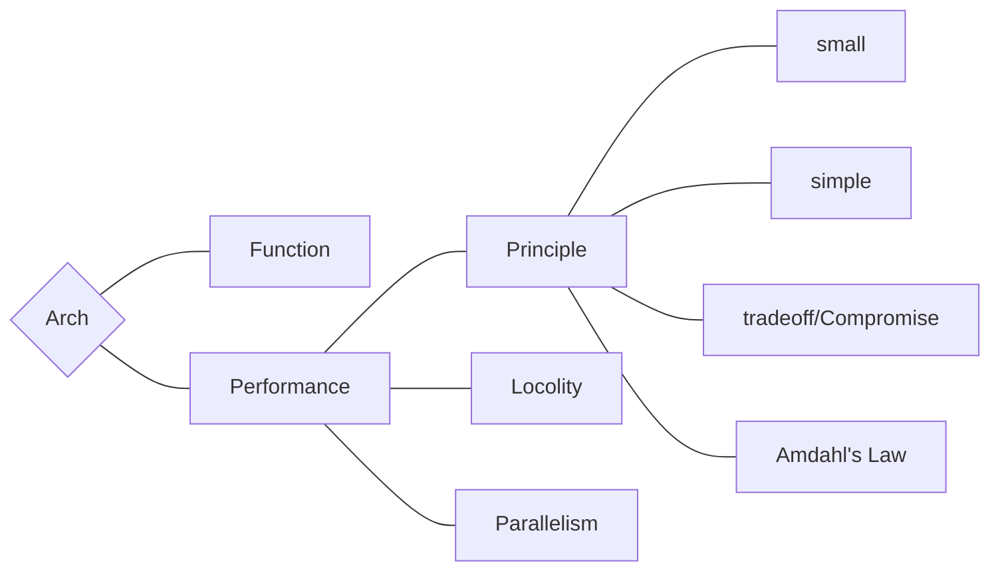

# Arch Note W14D1

> written by Yang-Jincheng

## Assessment of Architecture

## Function

based on Von Neumann's architecture

### Performance

metric: CPI (clock per instruction)

perf is about reducing latency

#### Principles

+ Small: the smaller, the faster

+ Simple: easy to process, like RISC

+ Tradeoff / Compromise

+ Amdahl's Law: pay attention to performance of the most common part
  
  $S_p = \dfrac{1}{(1-\eta) + \eta/s}$ 

### Parallelism

#### Pipeline (ILP)

+ **basic principle**
  
  balance among stages; speed up = N - stages

+ **Hazard**
  
  stalls & distance
  
  + **Structural Hazard: FU conflict**
    
    for example, memory conflict 
    
    solution: I/D-cache
  
  + **Data Hazard: data dependency**
    
    true dependency (RAW)
    
    solution: forwarding (small distance); out of order / move code (large distance)
    
    pseudo dependency
  
  + **Control Hazard: Branch & Jump**
    
    solution: early branch prediction; calculation delay (BTB); kill branch; delay slot filling

#### Super Scalar

### Locality

introduce Cache

$$
\mathrm{AMAT=HitTime + MissRate} \times \mathrm{PenaltyTime}
$$

Design of Cache

+ Direct Mapping

+ Full Association

+ Set Association
