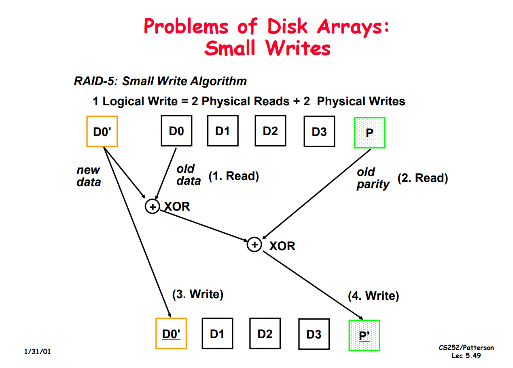
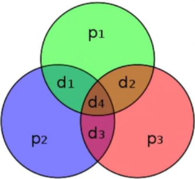

RAID 5

Small writes (write to one disk): 
- Option 1: read other data disks, create new sum and write to Parity 
Disk
- Option 2: since P has old sum, compare old data to new data, add 
the difference to P
• Small writes are limited by Parity Disk: Write to D0, D5 both also write to P disk



### Hamming code
use $\log_2n$ extra parity bits  
possible to find out wrong bit if one of the data bits flipped

(7,4) Hamming code  


```
bit 001 010 011 100 101 110 111
    p1  p2  d1  p3  d2  d3  d4
```

XOR sum in every circle should be 0.