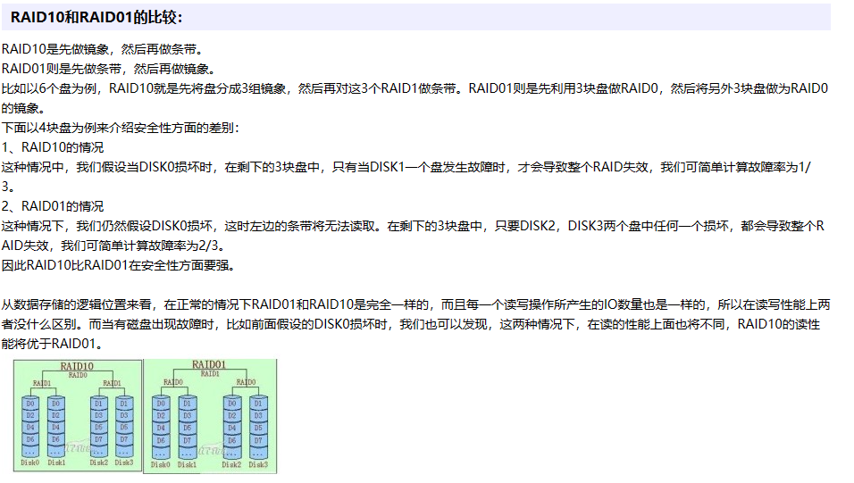

# Arch Week15 Day1

### Transaction

Transactional memory is a concurrency synchronization mechanism that combines groups of statements in transactions, that are

- atomic (either all statements occur, or nothing occurs)
- isolated (statements in a transaction may not observe half-written writes made by another transaction, even if they execute in parallel)

### Weak Memory Ordering

Any load or store operation can effectively be reordered with any other load or store operation, as long as it would never modify the behavior of a single, isolated thread. In reality, the reordering may be due to either compiler reordering of instructions, or memory reordering on the processor itself.

When a processor has a weak hardware memory model, we tend to say it’s *weakly-ordered* or that it has *weak ordering*. We may also say it has a *relaxed* memory model.

### RAID

### MPK

A memory protection key (MPK) mechanism divides physical memory into blocks of a particular size (e.g., 4 KiB), each of which has an associated numerical value called a protection key. Each process also has a protection key value associated with it. On a memory access the hardware checks that the current process's protection key matches the value associated with the memory block being accessed; if not, an exception occurs. 

