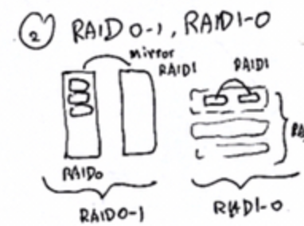
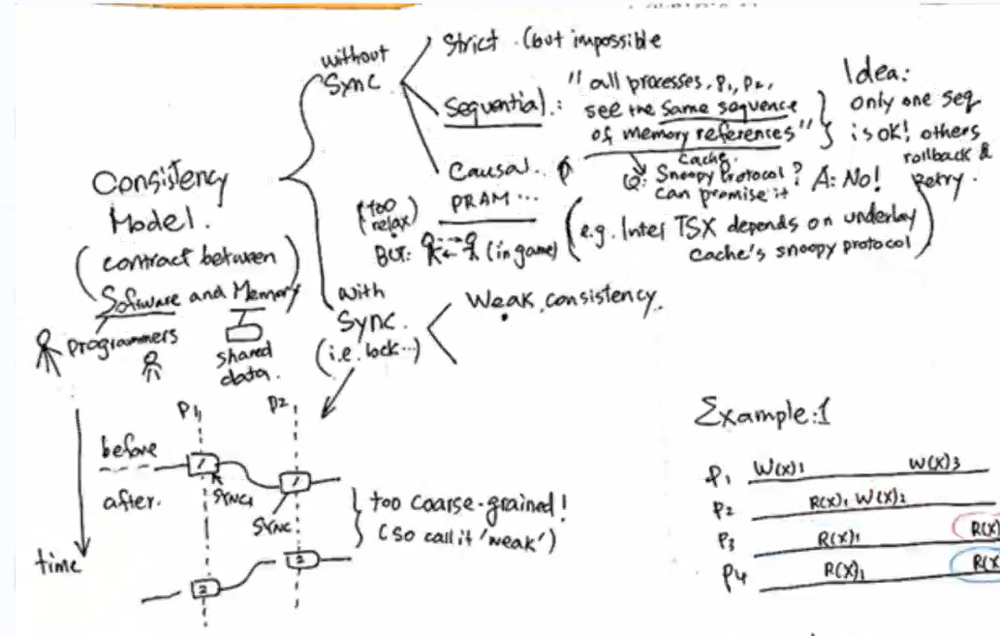
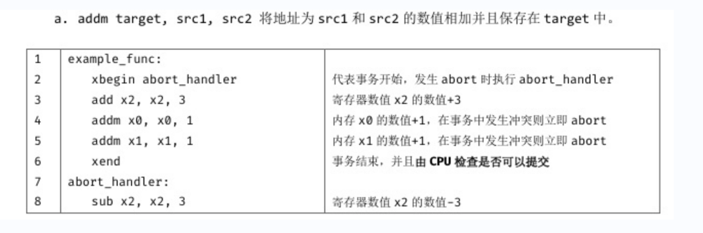

### 一、基础考点

流水+循环+跳转预测

没有跳转预测：加气泡（NOP指令 软气泡）

如果有跳转预测：猜得对 是什么样的（使用的是饱和计数器）

### 二、冗余存储

RAID 1-0 ：（概念如图）

RAID 0-1：落了两个RADI 的盘，位mirror

### 三、事务内存

transaction：数据库里的概念，完成一个事物，需要n步操作，这个操作的序列，要保证必须一口气做完，如果中间被人打断了，必须重新做

一致性：怎么理解Intel TSX 指令

重讲一遍一致性

一致性模型：软件与memory之间的一个合同

- 带同步，最weak的方式，必须大家都同意了，才能越过同步点，颗粒度较大，开销较大，保证越过同步点后都是一致的
- 不带同步
  - 最严格的方式：打一个绝对物理时间的标签，严格按时间顺序操作，基本不可能，只是个模型而已
  - sequential：可以通过技术实现的。定义：所有的进程 P1 P2 对共享的存储，可以看到相同的顺序（Intel 的考点在这），利用 cache 的 coherence

任何人修改，都要在总线上发 `invalid` 信号

可能要有一个 jump 指令？

add  x2 x2 3 不对memory操作

abort_handler为什么要做这件事情？

- 用一个寄存器存状态，看有没有出过事（相当于在xEnd清算）
- $x_3$  把cache中的 $x_0$ 换掉了，还没xend，此时无条件产生abort。

为什么要 sub x2, x2, 3

到xend检查状态位，看看从xbegin 到 xend 有没有出过事（几次无所谓

cache line：检测位 总线上发出一条 `invalid xxx`  出事了！

xbegin xend 每个line 都有一个监测位
