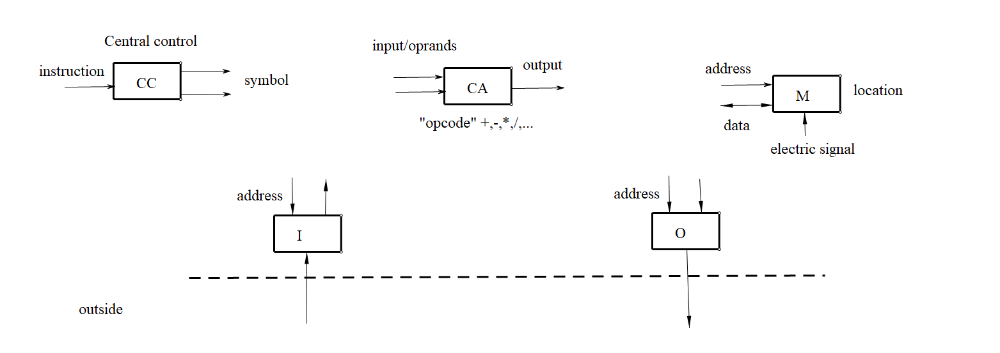
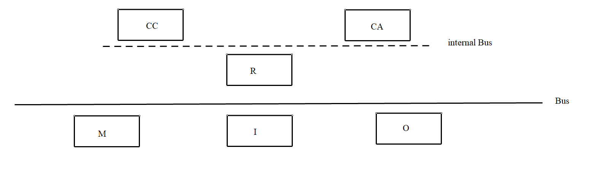
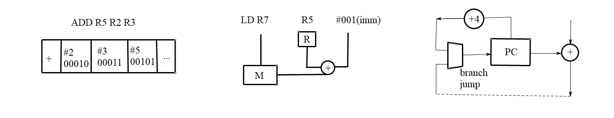
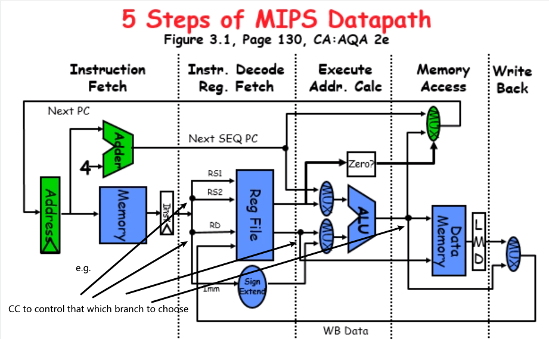

### Typical characteristics of Risc
- 1. 32-bit fixed format instruction (3 formats)
- 2. Memory access only via load/store instructions
- 3. 32 32-bit General Purpose Register (thogonal register) (it doesn't subject to the circumstances of application)
Exception:$R_0$ contains zero,DP(Dual Port Memory) take pair
- 4. 3-address,reg-reg arithmetic instruction;registers in same place
- 5. Single address mode for load/store:base+displacement
- 6. Simeple branch conditions
- 7. delayed branch
### Von neumann's Automatic Computing Device
3-instructions
- 1.Arith/Logic
- 2.DataTransf:MOV,LD/ST
- 3.Control:Jmp,Call
5-part

5-part exchange the data by Bus.

### Example of how other 3-instructions works

### 5 Steps of MIPS Datapath

It contains how all the 3-instructions work in one picture.