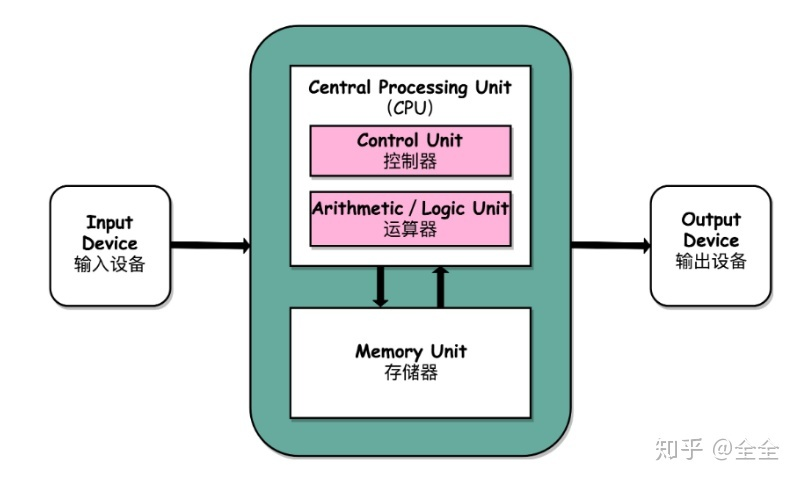
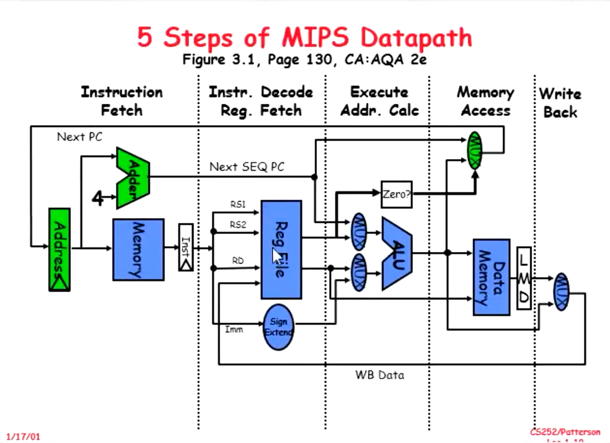

# Topic: RISC Instrutions

### 1. 32-bit fixed length instruction  
- better support for super-scalar ( aligndein memory)
- less information density in instructions
- easier to decode
### 2. Memory access only via load/store instrctions  
### 3. 32 32-bit GPR(general purpose registers)  
- orthogonal (general purpose):  
  no relevence in two different registers 
- pual port take pair:   
two instrction can access the same register in the same time
### 4. 3-address, reg-reg arithmetic instruction
- example: add -rs1 -rs2 -rd  
put the result of value(rs1) + value(rs2) into rd
### 5. single address mode for load/store: base + diaplacement
- example: ld rs1 offset rd  
the wanted memory address is value(rs1) + offset 
### 6. simple branch conditions
- Branch condition only in 
### 7. delayed branch
- When a branch instruction is processed, CPU stops fetching instrctions.  
- Slow, can be optimized by prediction  
   

# Topic: Von Neumann Structure
## 1. Five Units

- The CPU also contains registers.
- If a device have several CPU, a CPU can also be called a core.
- Interconnection in the structure is implemented by bus. Bus uses broadcast to communicate.  

## 2. Key of Performance
### Locality
- registers
- internal bus(used inside CPU) and system bus(connect CPU and other component)
### Parallelism
   

# Topic: Data Path
 
