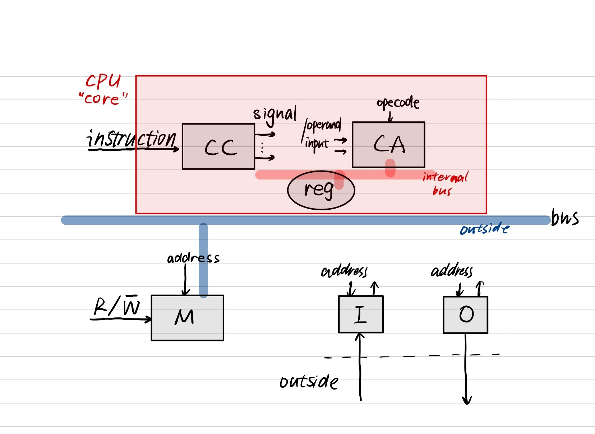

> Given the writer's poor ability, if any part has a flaw, please don't hesitate to let me know. thx

### A "Typical" RISC

Several features:

- 指令定长: 32-bit fixed format instruction (大体分为3类)
  
  1. Arithmetic/Logic: e.g. ADD
  
  2. DataTransfer: e.g. LD/ST

  3. Control: e.g. JMP/CALL
  
- 内存访问: Memory access only via load/store instructions

- 32-bit GPR(general purpose register), also called `orthogonal register` (orthogonal意为相关性低)
  
  - GPR vs SPR(special purpose register):
    
    SPR is designated for a purpose and that purpose alone, while GPR dosen't.
    
    However, R0 is always zero in GPR.
  
  DP(Dual Port) take pair:
  
  1. 两条指令同时读
  
  2. 或者支持一条指令读一条指令写

- 寻址模型: Single address mode for load/store: base + displacement(no indirection)
  
  有立即数寻址, 直接寻址, 间接寻址(2级/3级等...)
  
  1. 立即数寻址: 数据已经保存在立即数中, 可以直接使用
     
      如 mov eax, 0x1; //将数值1赋值给eax寄存器
  
  2. 直接寻址: 给出想要访问的内存单元的地址
     
     如 mov ebx, [0x00401000]; //将内存单元0x00401000中的数据赋值给ebx寄存器。
  
  3. 间接寻址: 想访问的内存单元的地址需要间接运算得到
  
  ~~联想alei老师课上的零件组装和批发商的关系(~~

- 简单分支: Simple branch conditions.
  
  Different from CISC, which has complex branch conditions such as Zero, LG(larger than), LE(less than), RISC only has Zero branch instruction.

- Delayed branch: the instruction following the branch is always executed before the PC is modified to perform the branch.

### Computer Architecture Draft:

- CC(Central Control): accept an instruction and output several signals

- CA: input/oprands + opecode $\rightarrow$ result 
- M(Memory): $\text{R}/\bar{\text{W}}$

  0: write  1: read

## MIPS 5-steps Datapath

### Arithmetic/Logic:

Rs1/Rs2/Rd are interpreted by 5bits. Because $2^5=32$ can represent 32 registers.

CC: sends ADD command to ALU

### DataTransfer:

### Control:

