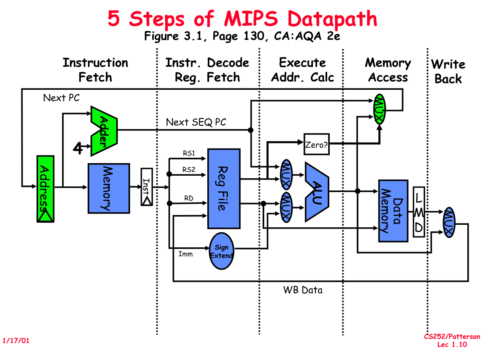

# Computer Architecture Notes

**Student: Liangsheng Yin**

**Date: week2 day1 (2022-09-19)**

***

### The features of a "typical" RISC

- fixed format instruction (usually 32-bit).
- Only `load`or `store` access memory 
  - **in cray CDC6600** Computer
- **GPR** : **G**eneral **P**urpose **R**egisters.
  - General vs Specific.
  - orthogonal registers.
  - `R0` contains zero.
  - DP means "dual port", two instructions can access a register at the same time.
- 3-address, reg-reg arithmetic instruction.
- Single address mode for load/store : 
  - Just one method : base + displacement.
  - No indirection.
- Simple branch conditions :
  - simple condition flags : just `Zero` judgment (**so cool!**)
- Delay branch for pipelines.

***

### Von Neumann Architecture (borrowed from Babbage's theory)

- `CC`, `CA`, `Memory`, `I`, `O`.
- Three types of instruction : 
  - Arithmetic or Logic
  - Data transfer 
    - MOV
    - LD or ST
  - Control
    - Jump
    - Call
- Memory(Something greedy)
- Using `BUS` to broadcast.

#### Later Architecture Development

- The performance depends on : 
  - Locality
  - Parallelism
- The `BUS` is exclusive, which is a locality problem : 
  - Setting **registers** near the `CC` and `CA`.
  - `CC`, `CA` and `registers` construct `CPU`, internal connection using another `BUS`.
  - Setting register : a type of cache.

***

### 5 Steps of MIPS Datapath

only contains CA, Memory

***

### Four big companies in computer history

- `IBM`
- `HP`
- `DEC`
- `SUN`
- pending ... `APPLE`

