## Note for Arch2022

### More details in 5-stage pipeline datapath design

+ **bus vs muxplexer**
  
  differ in the way of data tranfer 

+ **intereaction bewteen datapath & controlpath**
  
  

+ **signed extension**
  
  extend an integer by repeating its sign-bit (in 2's complement)
  
  to gurantee the correctness of arithmetic operations on integers with different lengths
  
  > for example,
  > 
  > `3 (4-bits) -> 0b0011`,
  > 
  > `-1 (2-bits) -> 0b11`.
  > 
  > without signed extension:  
  > 
  > `3 + ext(-1) -> 0b0011 + 0b0011 = 0b0110 -> 6 (4-bits)`
  > 
  > with signed extension:
  > 
  > `3 + sext(-1) -> 0b0011 + 0b1111 = 0b0010 -> 2 (4-bits)`

+ **between stages: inter-mediate / transfer registers**
  
  to prevent instructions from interfering with each other during their operation
  
  change combinational logic to sequential logic

+ **rd information**
  
  For L/S operations, `rd` won't be used when first passes the ALU. It's passed to the following stages and given back to ALU when it is actually being used, so that it won't block its subsequent instructions.

### Hazards in pipeline and their solution

Limits to pipelining: **Hazards** prevent next instruction from excuting during its designate clock cycle

#### Categories of Hazards

1. **Structural Hazrds**
   
   Hardware cannot support the combination of instructions.
   
   > for example, two instrctuons try reading and writing the memory in the same clock cycle
   > 
   > besides memory, ALU & other functional unit can also generate structral hazards when taking up by 2+ instructions at thr same time

2. **Data Hazard**
   
   Instruction depends on result of prior instructions still in the pipeline.
   
   + **Read After Write (RAW)**
     
     ```
     add r1,r2,r3
     sub r4,r1,r3 // data dependence on r1
     ```
     
     got incorrect result if excuting `sub` before finishing writing `r1` in `add`  
   
   + **Write After Read (WAR)**
     
     ```
     add r1,r2,r3
     and r3,r4,r5 // anti-data dependence on r3
     ```
     
     got incorrect result if excuting `and` before finishing reading `r3` in `add`
     
     >  won't happen in pipeline scheduling
   
   + **Write After Write (WAW)**
     
     ```
     add r1,r2,r3
     xor r1,r4,r5
     sub r6,r1,r7 // output dependence on r1
     ```
     
     > won't happen in pipeline scheduling

3. **Control Hazards**
   
   caused by delay between the fetching of instructions and decisions about changes in control flow (branches and jumps)


#### Solution to Hazards

general solution: **STALL** (or bubble)

RAW and WAW data hazards can be solved by **renaming**

> thus RAW and WAW hazards are also called **pseudo-/name-dependence hazards**


