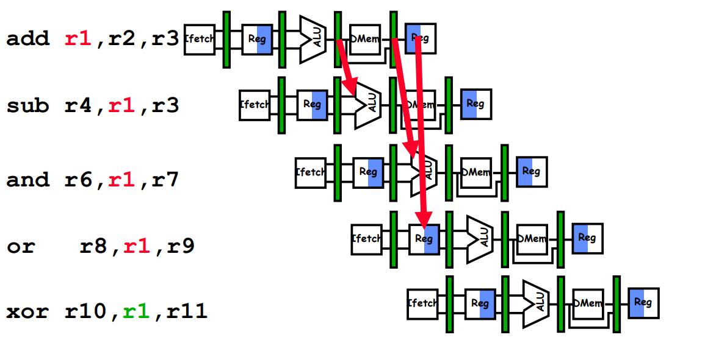
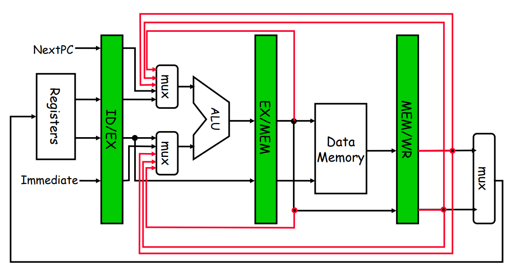
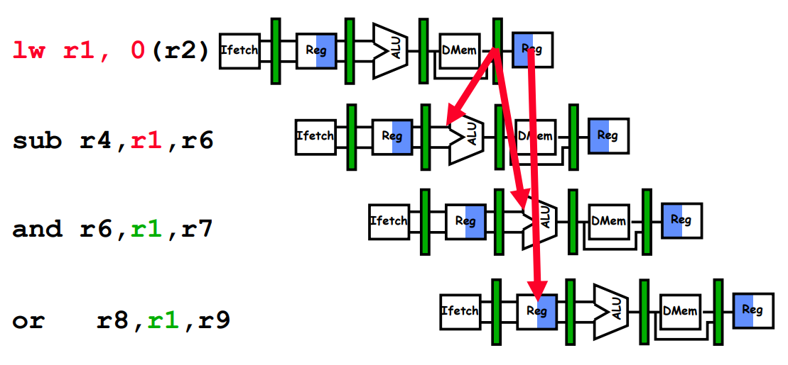
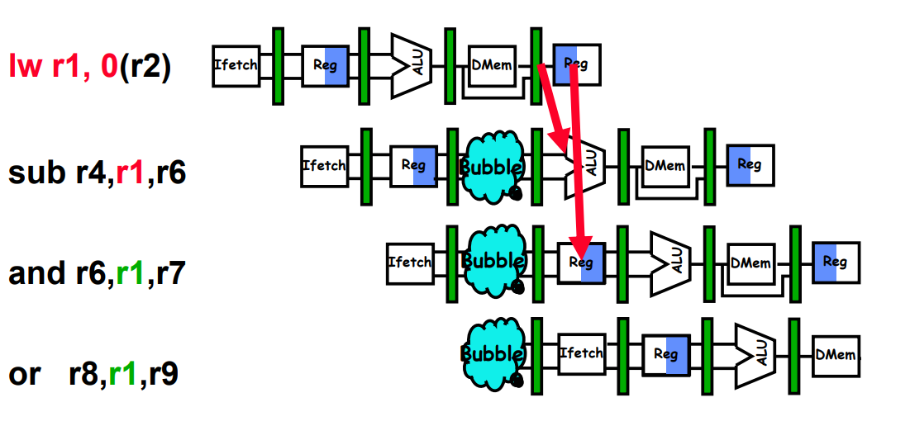
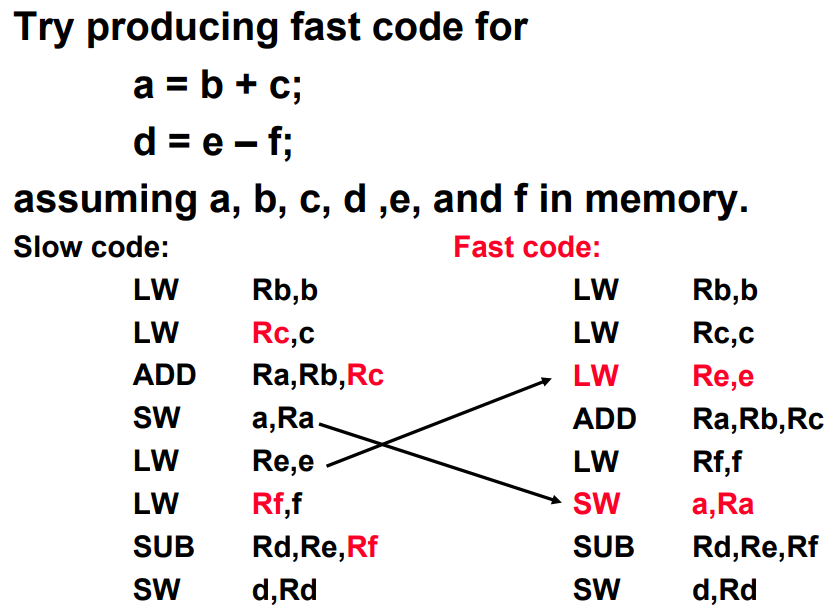
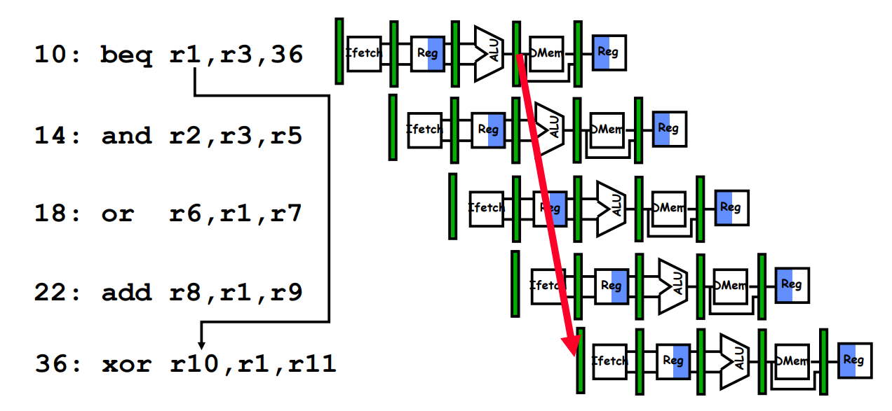
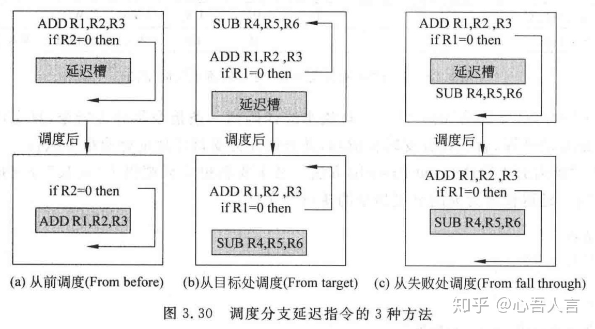

## Hazards and Solutions

three types of hazards: 

- Structural hazards
- Data hazards
- Control hazards

### Structural Hazards

When two (or more) instructions in the pipeline require the same resource, a structural hazard occurs.

solution: copy or dumplicating.

### Data Hazards

Data hazards occur when instructions that exhibit data dependence modify data in different stages of a pipeline.

three types of data hazards:

- RAW (read after write)
- WAR (write after read)
- WAW (write after read)

RAR(read after read) is not a hazard case.

Only RAW is true hazard. 

#### WAR

```
sub r4, r1, e3
add r1, r2, r3
```

This hazard results from reuse of the name "r1".

Can't  happen in MIPS 5 stage pipeline.

- Read are always in stage 2, and writes are always in stage 5.

#### WAW

```
add r1, r2, r3
add r1, r3, r4
```

This also results from the reuse of name “r1”.

Can't  happen in MIPS 5 stage pipeline.

- Writes are always in stage 5.

#### RAW

```
add r1, r2, r3
add r3, r1, r2
```

RAW caused by a "dependence".

Some solutions to RAW:

1. Forwarding to avoid data hazards

   

2. HW Change for Forwarding

   

3. Add some bubble when data hazards happen even with forwarding

   hazards happen:

   

   add some bubble:

   

4. Software Scheduling to Avoid Load Hazards



### Branch Hazards

The pipeline makes wrong decisions on branch prediction and therefore brings instructions into the pipeline that must subsequently be discarded

example:

beq causes 3 stage stall



MIPS Solution:

- Move Zero test to ID/RF stage
- Adder to calculate new PC in ID/RF stag

possible solutions:

1. Stall until branch direction is clear: guaranteed to increase latency.

2. Predict Branch Not Taken

3. Predict Branch Taken

   But haven't calculated branch target address in MIPS(still incurs 1 cycle branch penalty)

4. Delayed Branch

#### Delayed Branch

first fill branch delay slot with NOP(no operation)

then get instruction to fill it. (from current base block)

base block: a straight-line code sequence with no branches in except to the entry and no branches out except at the exit.

A base block contains 4 to 7 instructions on average.

fill about 60% of branch delay slot

enlarge base block:

```
for (int i = 1; i <= 100; ++i) {
	s = s + i;
}

for (int i = 1; i <= 100; i += 4) {
	s = s + i;
	s = s + i + 1;
	s = s + i + 2;
	s = s + i + 3;
}
```

