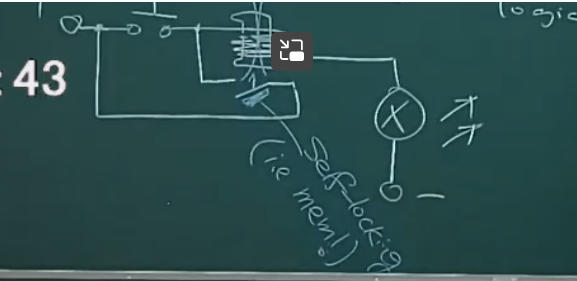
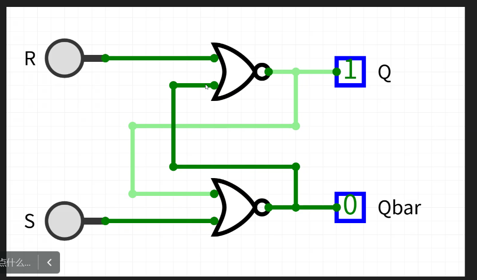
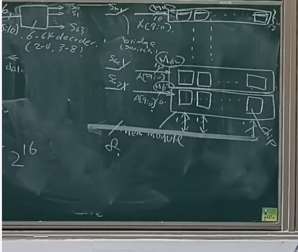

# W5D1 Arch notes

###### 陈永杉

### Mem Hierarchy

### 1.Register/Cache/Mem/Disk

### 2.MemoryTechnology

Memory is the only one can be visited directly.

#### How to store data in eletronic elements

stateful logic vs. Combinational logic

origin idea: a selflock electric circuit

Then we have latcher/trigger (for example: SR latcher)

Another idea: using the magnetization and demagnetization of a coil to record data. Problem: respond time too long.

Register:Rs_latcher

Memory: using capacity.

The advatdage of the capacity: low cost.

The disadvantage fo capacIty: not stable.

solution: make capacity/voltage smaller.(about 1 V)(lower voltage require higher detect  precision and may happen happen volatile)

#### Spam/Dram/Rom EPROM(or flash)

we have DRAM/SDRAM $\rightarrow$ DoubleDatchRate

### 3.Interface 

##### e.g. DRAM + CPU

Standard bus: Memory has many locations, while CPU connecting with the Memory, the core must know the location and the read/write situation.

$\textbf{A technical problem}$: when we only have memories which are 1 bite wide and size $2^{10}$. But we hope it's 1 Byte wide and $2^{16}$ size. To archieve this, we put 8 memories together, to make it wider, and to make it bigger, for avery block, for its size is $2^{10}$, we only need 10 wines. And we put 64 blocks together, then we get $2^{16}$ size. And to oonly read one origin memory at one time, we use 'bridges' to control it. Adn we need a decoder to decide to connect which bridge.

### 4.Timing

As the RAM becones bigger, we also need more pins (read/write/power), which make chips become bigger and bigger. To decreae its size, we make the address two dimensions, sent in two times (row address and col address).

RowAddressSelection/ColumnAddressSelection/WritingEnable/OutputEnable

there are small chips in the RAM recording the RAM's rate.
