# W5D1 Notes

林田川  2022.10.10

## 储存层次 Memory Hierarchy

Register/Cache/Memory/Disk

## 储存技术 Memory Technology

如何制造具有记忆能力的器件？

Stateful logic 状态逻辑 （vs. combinational logic 组合逻辑）

### 电气 Electrical

ON 按下后，电磁铁吸引下方开关 S 闭合；即使 ON 松开，S 开关仍然闭合。这种状态称为「自锁（Self-locking）」，具有记忆功能。OFF 按下后，电磁铁不再通电，S 断开，实现重置。

### 电子 Electronic

锁存器/触发器 latcher/trigger/...
e.g. R-S (Reset-Set) 锁存器

速度：电气 ms 级，电子 µs ns 级

电容的充放电可以储存数据，但是速度比较慢，降低充放电时间会使稳定性下降（volatile）。

### 内存技术杂谈（不展开）

- SRAM (static) / DRAM (dynamic) / ROM
- EPROM (or flash)
  - NAND
  - NOR
- DRAM / SDRAM (sync) / DDR (Double Data Rate)

没有一直技术能够做到又大又快又便宜。

## 接口技术 Interface Technology

e.g. DRAM - CPU

技术问题：已知能订购到的 memory 宽度 1 bit，大小 1 Kibit（称为 chip），希望构建宽度 1 Byte，大小 64 KiB 的 memory。

首先 8 个 chip 组成一个宽度为 1 Byte，大小 1 KiB 的 module，然后 64 个 module 组成 memory。

地址线的最高 6 位决定选择哪个 module，由 6-64 译码器（6-64 decoder）实现。

## 内存读取时序 DRAM Read Timing

内存容量扩大之后，地址线需要的引脚更多了，然而芯片的大小有限，难以放置太多引脚。解决方法是将地址的高位和地位拆开（称为行地址和列地址），分两次传输。

一些术语解释：

- _L 后缀: 低电平有效
- RAS: Row Address Selection
- CAS: Column Address Selection
- WE: Writing Enable
- OE: Output Enable (or Reading E)
- D: Data
