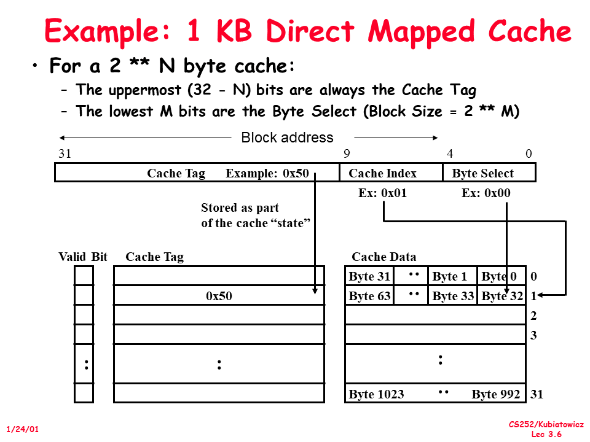
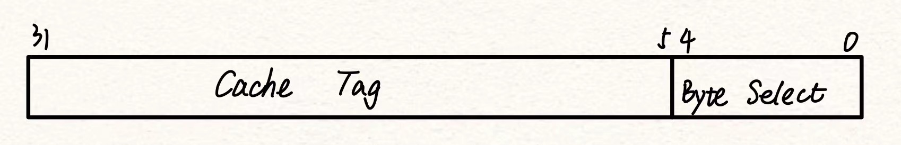
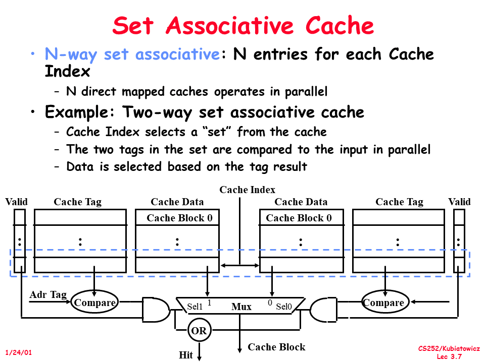
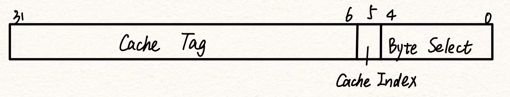

# W5D2: Cache

> by 范棋珈

## 1. 基本思想

### 1.1 局部性原理（Principle of Locality）

> CAAQA5 Page 45, B-2 

*Programs tend to reuse data and instructions they have used recently.*

这是 Cache 所利用的基本原理。具体有两个方面的内含：

- 时间局部性原理（Temporal locality）

  > 即更可能访问近期使用的数据。

- 空间局部性原理（Spatial locality）

  > 即近期更可能访问地址相邻的数据。

### 1.2 Cache 与 Buffer

Cache 和 Buffer 不同。*Cache* 是利用局部性原理缓存一部分数据，使得常用数据能经常被快速访问到，从而提高运行效率；而 *Buffer* 为缓冲区，旨在平衡两端的速度差异。比如 CPU 要向内存写入一些数据，但内存写入速度比 CPU 执行速度慢很多，此时可以将数据先快速写入 *Buffer* 中，然后 *Buffer* 再慢慢把数据写入内存中。

### 1.3 4 Questions for Memory Hierarchy

> CAAQA5 Page B-6, B-7

对于某一内存阶层（memory hierarchy），需要解决以下 4 个问题：

- Q1: Where can a block be placed in the upper level? (*block placement*)
- Q2: How is a block found if it is in the upper level? (*block identification*)
- Q3: Which block should be replaced on a miss? (*block replacement*)
- Q4: What happens on a write? (*write strategy*)  

接下来要说的 Cache 与 Memory 的映射方式即在回答 Q1 与 Q2。

在 Memory Hierarchy 中，较高层结构中的数据为较低层结构的数据的子集。由此，需要建立一种较低层到较高层结构的映射。

## 2. 映射（mapping）

> CAAQA5 Page B-7 to B-9

基于空间局部性原理，Cache 中的数据是以**块**（block）为单位从内存读取的。根据每个块在 Cache 中的位置限制的不同将映射方式分为三类：**直接映射**（direct mapped）、**全相联**（fully associative）和**组相联**（set associative）。

### 2.1 直接映射（direct mapped）

#### Answer to Q1

该方法下，一个块在 Cache 中对应的位置是唯一确定的，通常确定的方式为取模。

设 Cache 有 $B$ 个块，那么内存中第 $c$ 个块便映射到 Cache 中第 $c\bmod B$ 个块。

> "取模"实际上是按位与——Cache 与内存的各项大小是 2 的整次幂。

#### Answer to Q2

我们来看看在这种映射方式下，<u>对于一个内存地址应如何找到其在 Cache 上的位置。</u>

首先，对于**内存地址**，可以将其分为 ***Cache Tag***、***Cache Index*** 与 ***Byte Select*** 三个字段（field）。其中：

- *Cache Tag* 用来确定是否命中（hit）数据；

- *Cache Index* 用来确定对应块在 Cache 上是第几个块；

  > 在组相联中，*index* 解释为 Cache 上的第几个组（set）。

- *Byte Select* 表示所需数据在块中对应第几个字节。

前两个字段合起来又称为**块地址**（block address），表示该字节所在的块在内存上是第几个块。来看 PPT 上的例子：

例子中，总地址位数为 $32$，Cache 大小为 1 KB，共有 32 个 block，每个 block 中 32 个 byte，则需要 5 位的 *Cache Index* 和 5 位的 *Byte Select* 字段。假设现在我们需要一个 byte 的数据，其在内存上的地址记为 $A[31:0]$。那么：

- $A[4:0]$ 表示所需数据在块中的字节偏移量（*Byte Select*）。

- $A[31:5]$ 即为所需数据所在的块在内存中是第几个块（*Block Address*）。根据直接映射的规则，这个块对应到 Cache 中的块的位置（index）为 
  $$
  A[31:5]\bmod 32=A[9:5].
  $$

  > 在命中（hit）情况下，*Cache Index* + *Byte Select* 即可确定所需字节在 Cache 上的位置。

- 我们还需判断数据是否命中，即 Cache 上这个位置存的块是不是我们想要的块。解决方案是对于每个 Cache block，<u>都存下这个块的块地址的 *Cache Tag*</u>，并与 $A[31:10]$ 比较。容易知道，如果二者相等，那么这个位置存的块就是我们想要的块，否则即为 miss。

> 当然，对于上文，实际硬件判断的逻辑顺序应为倒序。

### 2.2 全相联（fully associative）

#### Answer to Q1

在该种方式下，内存中的某个块可以存到 Cache 上的<u>任意位置</u>，没有映射限制。

当要缓存一个块到 Cache 上时，优先考虑空余的块。为了判断 Cache 的某个位置是否空闲，对于每个 Cache block，增加存储一位 ***Valid Bit***（见上图）来存储是否占用的信息。

> 若无空闲位置，则涉及到缓存的替换策略（replacement strategies），该部分先不考虑。

#### Answer to Q2

由于全相联的任意性，此时需要遍历整个 Cache 寻找是否有符合的块。

而要正确判断命中与缺失，需要比较 Cache 上所存块的地址与所需块的地址是否<u>完全相同</u>，那么此时 *Cache Tag* 字段即为整个 *Block Address* 字段，且不再有 *Cache Index* 字段。

#### 直接映射 vs 全相联

- 直接映射：速度快，不用一个个比。但空间利用率可能较低，且在某些极端情况下（如 `strcmp(s1, s2)` 且 `s1` 与 `s2` 所在块的 Cache Index 相同时）时间效率较低。
- 全相联：空间利用率高。但在 Cache 上找数据时需要一个个比对，且会增加一点硬件复杂度。

接下来的组相联可以说是结合了上述的两种映射方式。

### 2.3 组相联（set associative）

#### Answer to Q1

一个块可以存到 Cache 的某一组块中的任意一个位置，其中**组**（set）是一些缓存块构成的集合。

设 Cache 有 $S$ 个组，那么内存中第 $c$ 个块便先用类似直接映射的方式映射到 Cache 中第 $c\bmod S$ 个组，然后在组内相当于是全相联的方式寻找。

> 若将 Cache 分为 N 个 set，则称为 N 路组相联。常见的有二路、四路、八路组相联等。

#### Answer to Q2

可以结合前两种方式理解。以二路组相联为例，此时 ***Cache Index*** 即为 *Block Address* 的最后 1 个 bit（$A[5:5]$），表示是第几个组，然后分两路在 Cache 中寻找是否有对应的块。其中，***Cache Tag*** 字段为 $A[31:6]$，如图。

> 1. 从地址字段角度，可以把直接映射和全相联理解为特殊的组相联：当 Cache Tag 字段增大、Cache Index 缩为 0 bit 时便成了全相联，而 Cache Tag 字段缩小、Cache Index 字段增到 Cache block 的总数时便成了直接映射。
> 2. 在内存大小一定时，所需的 Block Address (Cache Tag + Cache Index) 字段大小为定值。

#### Disadvantage of SA

多路比较的组合电路与 Mux 相比起直接映射有一定的延时。

--------

## 之后内容“预告”（Alei 下课前提到）

### 替换策略（replacement strategies）

> CAAQA5 Page B-9
>
> Answer to Q3

在全相联、组相联映射策略中，当 Cache 满的时候应该替换掉哪个块呢？常见的策略有：

- 先入先出（FIFO）算法：替换掉最早载入的。
- 最近最少使用（LRU）算法：替换掉到目前为止使用次数最少的。
- 最不经常使用（LFU）算法：替换掉上次使用时间最远的。
- 随机（Random）算法。

### 写策略

> CAAQA5 Page B-11
>
> Answer to Q4

当 CPU 要写入数据时，在 Cache 上分为两种情况：写命中（即要写的数据在 Cache 上）和写缺失（要写的数据不在 Cache 中）。这两种情况下分别有不同的 Cache 策略。

#### 写命中策略

- *Write Through*：写入缓存时也同时写入内存里。

- *Write Back*：写入缓存时先不写入内存里，直到其将被替换时再写入内存中。

#### 写缺失策略

- *Write Allocate*：先将对于块加载到 Cache 中，再按照写命中处理。
- *No-write Allocate*：不加载到 Cache 中而直接修改内存。
