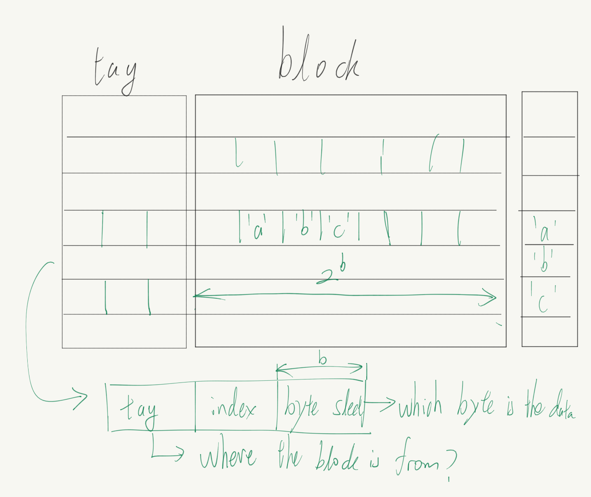
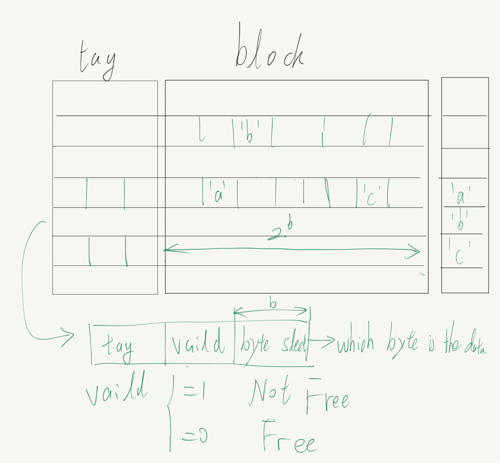

## Cache

### Principle

Cache is useful because of the locality (**Spatial Locality** & **Temporal Locality**).

### Mapping

Problems to Solve:

1. Where to store the data in cache?
   
   Three ways of mapping :
   
   1. DM (direct mapped)
   
   2. FA (fully associative)
   
   3. SA (set associative) (combining DM and FA)

2. How to find the stored data in cache?
   
   Follow the way of mapping.

#### direct mapped

DM ensure that continuous data is stored in one block in the cache.

DM is fast but low in space utilization.

#### fully associative

FA allows data to be stored anywhere in the cache, so index is useless.

Instead, it use vaild to record whether a block is in use.

FA is slower but take better use of space.

#### set associative

SA combine the DM and FA, so every **block** can be stored in any place in a certain **Set**.

> To be exact, if there is $S$ sets in a cache, the block number $c$ in RAM is stored in the $c\ \bmod\ S$ set. Then it find an free space like FA to store the data.

SA has the disadvantage of high delay.

