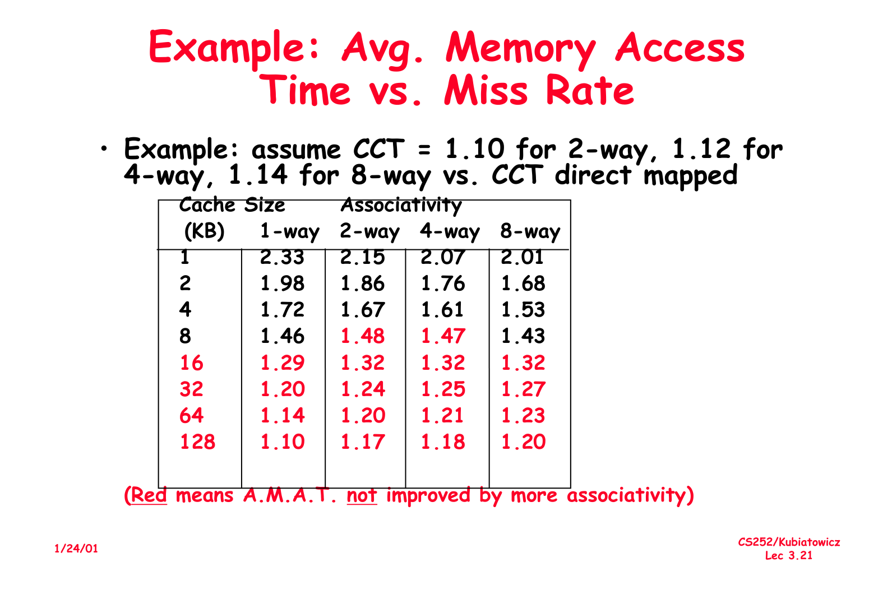
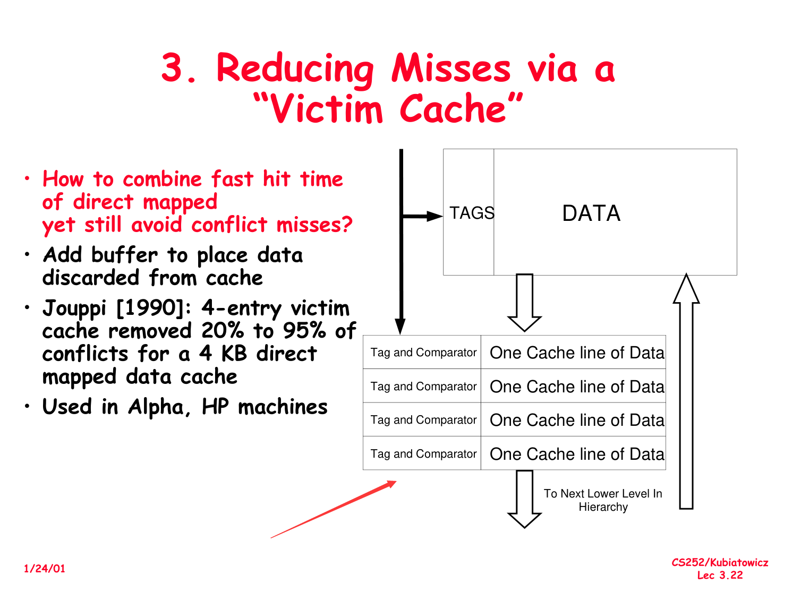
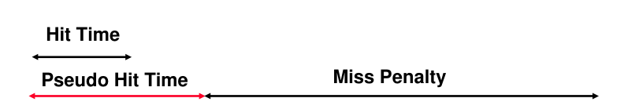
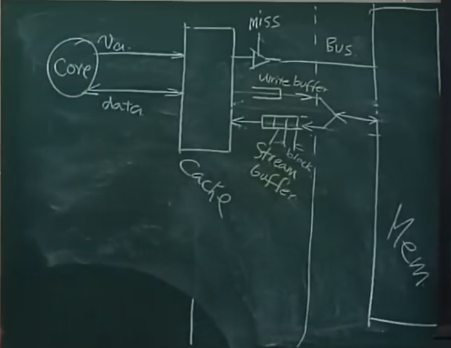

# Optimization for Reducing Misses
- [Optimization for Reducing Misses](#optimization-for-reducing-misses)
  - [Why Miss ?](#why-miss-)
  - [1.Reduce Misses via Larger Block Size.](#1reduce-misses-via-larger-block-size)
  - [2.Reduce Misses via Higher Associativity](#2reduce-misses-via-higher-associativity)
    - [An example](#an-example)
  - [3.Reducing Misses via Victim Cache](#3reducing-misses-via-victim-cache)
    - [Write Buffer](#write-buffer)
  - [4.Reducing Misses via Pseudo-Associativity](#4reducing-misses-via-pseudo-associativity)
  - [5.Reducing Misses by Hardware Prefetching of Instruction & Datals](#5reducing-misses-by-hardware-prefetching-of-instruction--datals)

## Why Miss ? 

- Compulsory Misses: The first time a block is accessed, it must be fetched from memory.
- Capacity Misses: The block is not in the cache, but the cache is full.
- Conflict Misses: Set associative or direct mapped cache.

## 1.Reduce Misses via Larger Block Size.

- When block size first increases, miss rate decreases, as an array can be stored in a single cache block, which reduces the probability of compulsory misses.

- When block size increases further, miss rate increases, as the lines (the number of cache blocks) decreases, which increases the probability of conflict misses.

## 2.Reduce Misses via Higher Associativity

- **2 : 1 Cache Rule** : **When cache size is small, to achieve the same miss rate**(the **same rate** should be highlighting), doubling the associativity brings half reduction in cache size.
- **Half** cache size with **doubled** associativity : the lines reduces to a **quarter**, why the conflicts still reduce ?
  - The relation between two associative ways is **full associative**.
  - Two ways to entry : same indexed block can be placed more.

### An example

`AMAT` : average memory access time

$$
AMAT = T_{hit} + \eta_{miss\ rate}\times T_{p}
$$

When associativity raises, **the miss rates definitely decrease**, **but the hit time increases**, so the `AMAT` is not always decreasing.

So we have a $\wedge$ when cache size is 8kb in the above graph.

How to optimize ? 
- Set a comparator for every associative way.
- speed decreases with log2(associativity).

## 3.Reducing Misses via Victim Cache

    
Combine fast hit time of **DM** yet still avoid **conflict misses**.

A buffer to store the ready-to-discard block : four blocks in the above graph.

### Write Buffer

store the data to be written into the cache.

**writing through** : write the data into the cache and memory at the same time.
- Why ? 
- `DMA` : direct memory access, `Memory` and `I/O` are connected directly.
- Multiple cores : others `cpu` will get the wrong data.

So place a write buffer between cache and memory.
- Add a tag on every single data.
- Even the write buffer is not full, the data will be written into the cache.(**Maybe the screen needs to be refreshed.**)

## 4.Reducing Misses via Pseudo-Associativity

Make use of the free space in the cache : according to the highest bit of index, the conflict data will be placed in another index.

How to get the data in cache ?
- by index first, then compare the tag.
- if not match, then compare the tag in the corresponding index.

    
- We then have the extra `Pseudo Hit Time`.

**Then the problem comes!**

If the corresponding position happened to be filled with the same tag but not with the transformed (by the highest bit of index) index, then the core will get the wrong data!

**How to solve it ?**

Append the tag-recorder with the highest bit of index, then we can solve it !

## 5.Reducing Misses by Hardware Prefetching of Instruction & Datals

**Prefetch!!!**

- When cache fetches data from memory, it will fetch the next block of data at the same time.
- Relies on having extra memory bandwidth.
- If have multiple streambuffers, then every streambuffer stores one single prefetched data.