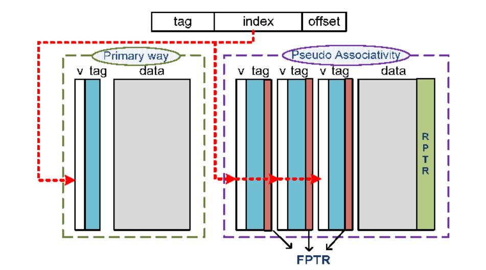

## Several ways of Reducing Misses

### 1. Larger block size

### 2. Higher Associativity

### 3. Victim Cache

victim cache: buffer that to place data **discarded** from cache

- 当 Victim Cache 中的data重新回到Cache中, 不一定会回到原先的位置

- Q: slightly larger cache vs Victim Cache(size: e.g. 4-Cache line)?

  A: Victim Cache preserves lately discarded 4 entry, it's more complicate to enlarge Cache size.

- Write Buffer vs Victim Cache

  - Write Through的重要性:

    1. 以DMA为例, 它负责Mem $\leftrightarrow$ I/O的数据读写。

       显存需要通过DMA拿出数据后再到达显卡。故, 若如果不write through, 则Mem不会立刻被修改, 进一步造成屏幕显示的延迟

    2. multi-core 

       share the same memory(need sync)

  - What does Write Buffer do?

    It can be used to hold data being written from the cache to main Mem. → reduce latency

  - Difference:

    Alei老师的例子: 

    write buffer(厨余垃圾 data-厨房垃圾桶 write buffer-小区垃圾站 mem)

    victim buffer(杂物 data- 杂物间victim buffer-清除杂物 go back to mem)

    二者在实现层面非常类似, 但概念却不同.

### 4. Pseudo Associativity

假设已经在 idx[x]的位置上存放了x

当要访问数据y时, 若idx[x]=idx[y], 且tag[x] != tag[y] (以为这第一次cache查询没找到y)

反转一下idx[y]的MSB, 再访问idx'[y]: (第二次查询)

- idx'[y]为空: 访问Mem
- idx'[y]不为空: 再次比较tag
  - 为tag[y]: 访问成功
  - 为tag[z]: 访问Mem

**上述过程需要在tag前多加一位来记录MSB, 否则会出现数据冲突的情况**

### 5. Prefetching

stream buffer (大小单位: block)

​	When a miss occurs, we need to fetch missed block. Without stream buffer, we only need to fetch one block which is missed. However, we will fetch 2 blocks on a miss with stream buffer and preserve one of them in the stream buffer.

假设有4个stream buffer, 可以理解为它把最近访问的4个Cache block的大小都"double"了.

减少了: Compulsory miss.

