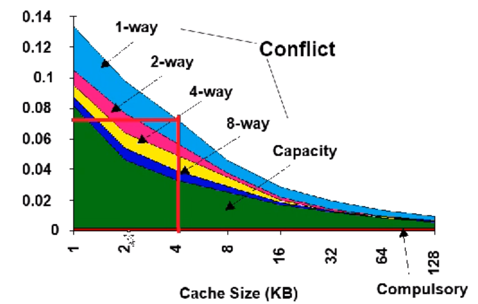
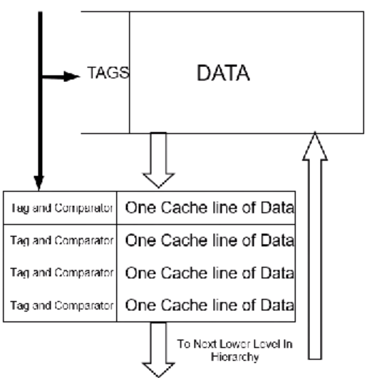
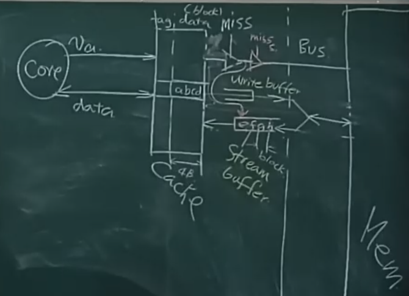

### 3 Cache Miss
- Compulsory: The first access to block is not in a cache, so the block must in brought into the cache.Also called "cold start misses" or "first reference misses".
- Capacity: If the cache cannot contain all the blocks needed during execution of a program, capacity misses will occur due to blocks being discarded and later retrieved.
- Conflict: If block-placement strategy is set associative or direct mapped, conflict misses (in addition to compulsory & capacity misses) will occur because a block can be discarded and later retrieved if too many blocks map. Also called collision misses or interference misses.

### 2:1 cache rule
miss rate 1-way associative cache size X $\approx$ miss rate 2-way associative cache size X/2.

### The formula of AMAT
$AMAT_{cache}=T_{hit}+\eta_{miss\space rate}T_p$
If we improve the degree of association, then we can know that the miss rate will decrease, but we may use more comparing unit and switch to lower $T_{hit}$.

### Victim cache

We have four line to put the cache that is out of date, and we can use it when we need it and move it from victim cache to the cache.

4-entry victim cache removed 20% to 95% of conflicts for a 4 KB direct mapped data cache.

### Writing through vs Writing Back
Writing through means when we modify the cache, we modify the memory as well. But we can imagine that cache is useless. So the writing buffer came out, we just modify the data in writing buffer but not modify the data in the memory when the cache is modified.

Writing back means when we modify the data in the cache, we called this block "dirty block", when they are cleared in the victim cache, they should be update to the memory.
### Pseudo-Associativity
When we put the data, we first find the cache line by index, but if the cache line is not valid, then we can put the data into the cache line, whose highest bit is on the contrary to the index of the data.
But when there exists two datas whose tag is same and the index is different in the highest bit, then the problem will occur. So we just carry the highest bit with the index.
This method will reduce the compulsory miss but will increase the hit time.
### Stream cache

When we load the cache, we will load the following data in the memory to the Stream buffer. Then when we miss the hit in the cache, we will find it in the Stream buffer first, then if the git is miss, then we will find it in the memory.