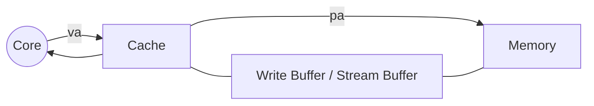

# Note for W7D1

*Authored by Liu Yi-Yu*

Target: reduce $AMAT = HitTime + MissRate \times MissPenalty$

## 5. Reducing Misses by Hardware Prefetching Data



## 6. Reducing Misses by Software Prefetching Data

### Load to a register

### Touch a memory address (cache)

### Make accessing order to be consistent with the order in memory

## Different Kinds of Memory

- SRAM
  - R-S
  - D-latch
- DRAM
  - electric capacity
- EDU / FP
- SDRAM

## 7.Reducing Misses by Compiler Optimization

### Instruction
- Reorder procedures in memory so as to reduce conflict misses
- Profiling to look at conflicts(using tools they developed)

### Data
- Merging Arrays
  - Reducing conflicts between val & key:
```c++
/* Before: 2 sequential arrays */
int val[SIZE];
int key[SIZE];
/* After: 1 array of stuctures */
struct merge {
  int val;
  int key;
};
struct merge merged_array[SIZE];
```

- Loop Interchange
  - Sequential accesses instead of striding through memory every 100 words
  - improved spatial locality
```c++
/* Before */
for (k = 0; k < 100; k = k + 1)
  for (j = 0; j < 100; j = j + 1)
    for (i = 0; i < 5000; i = i + 1)
      x[i][j] = 2 * x[i][j];
/* After */
for (k = 0; k < 100; k = k + 1)
  for (i = 0; i < 5000; i = i + 1)
    for (j = 0; j < 100; j = j + 1)
      x[i][j] = 2 * x[i][j];
```

- Loop Fusion

```c++
/* Before */
for (i = 0; i < N; i = i + 1)
  for (j = 0; j < N; j = j + 1)
    a[i][j] = 1 / b[i][j] * c[i][j];
for (i = 0; i < N; i = i + 1)
  for (j = 0; j < N; j = j + 1)
    d[i][j] = a[i][j] + c[i][j];
/* After */
for (i = 0; i < N; i = i+1) {
  for (j = 0; j < N; j = j+1) {
    a[i][j] = 1 / b[i][j] * c[i][j];
    d[i][j] = a[i][j] + c[i][j];
  }
}
```

- Blocking: 

```c++
/* Before */
for (i = 0; i < N; i = i+1) {
  for (j = 0; j < N; j = j+1) {
    r = 0;
    for (k = 0; k < N; k = k+1) {
      r = r + y[i][k]*z[k][j];
      }
    x[i][j] = r;
};
/* After */
for (jj = 0; jj < N; jj = jj+B)
  for (kk = 0; kk < N; kk = kk+B)
    for (i = 0; i < N; i = i+1)
      for (j = jj; j < min(jj+B-1,N); j = j+1) {
        r = 0;
        for (k = kk; k < min(kk+B-1,N); k = k+1) {
          r = r + y[i][k]*z[k][j];
        }
        x[i][j] = x[i][j] + r;
      }
```
