# Arch Note W7D1

>  written by Yang Jin-cheng

## Review

reduce Average Memory Access Time

$\mathrm{AMAT = HitTime + MissRate} \times \mathrm{MissPenalty}$

## H/W Prefetching



write buffer can implemented based on: a) victim cache; b) wirte through design

## S/W Prefetching

1. Binding Prefetch: Loading data from MEM to register
   
   + uses LD instructions
   
   + takes up 1 regsiter

2. Non-Binding Prefetch: Laoding data from MEM to cache 
   
   + uses specific instructions, TOUCH for example 
   
   + doesn't take up any register

> related concept: MHSR (outstanding memory access)

## Compiler Optimization

### Merging Arrays

Before: 

```cpp
// BEFORE
int val[SIZE];
int key[SIZE];

// AFTER
struct merge {
    int val;
    int key;
};
```

In this optimization, the expected <u>access sequence</u> is close to the <u>location sequence</u> of data. Thus spatial locality is improved. 

### Loop Interchange

```cpp
// BEFORE
for (k = 0; k < 100; k = k + 1)
    for (j = 0; j < 100; j = j + 1)
        for (i = 0; i < 5000; i = i + 1)
            x[i][j] = 2 * x[i][j];

// AFTER
for (k = 0; k < 100; k = k + 1)
    for (i = 0; i < 5000; i = i + 1)
        for (j = 0; j < 100; j = j + 1)
            x[i][j] = 2 * x[i][j];
```

adjust data acesss order, spatial locality improved

### Loop Fusion

```cpp
// BEFORE
for (i = 0; i < N; i = i + 1)
    for (j = 0; j < N; j = j + 1)
        a[i][j] = 1/b[i][j] + c[i][j];
for (i = 0; i < N; i = i + 1)
    for (j = 0; j < N; j = j + 1)
        d[i][j] = a[i][j] + c[i][j];

// AFTER
for (i = 0; i < N; i = i + 1)
    for (j = 0; j < N; j = j + 1) {
        a[i][j] = 1/b[i][j] + c[i][j];
        d[i][j] = a[i][j] + c[i][j];    
    }
```

completes related calculation in a singel loop

spatial locality improved, increasing the chance of cache hit

### Blocking

```cpp
// BEFORE
for (i = 0; i < N; i = i + 1)
    for (j = 0; j < N; j = j + 1) {
        r = 0;
        for (k = 0; k < N; k = k + 1)
            r = r + y[i][k] * z[k][j];
        x[i][j] = r;
    }

// AFTER
for (jj = 0; jj < N; jj = jj + B) 
    for (kk = 0; kk < N; kk = kk + B) 
        for (i = 0; i < N; i = i + 1)
            for (j = jj; j < min(jj + B - 1, N); j = j + 1) {
                r = 0;
                for (k = kk; k < min(kk + B - 1, N); k = k + 1)
                    r = r + y[i][k] * z[k][j];
                x[i][j] = r;    
            }
```

reduce the chance of cache conflict

the perfermance of this optimization is related to the value of `B`

## Development of MEM

+ SRAM (R-S latch based) vs DRAM (capacitor based)

+ EDO vs FP

+ rambus (to support outstanding memory acess)

+ SDRAM (sync cpu & mem)

+ DDR (double digit rate)
