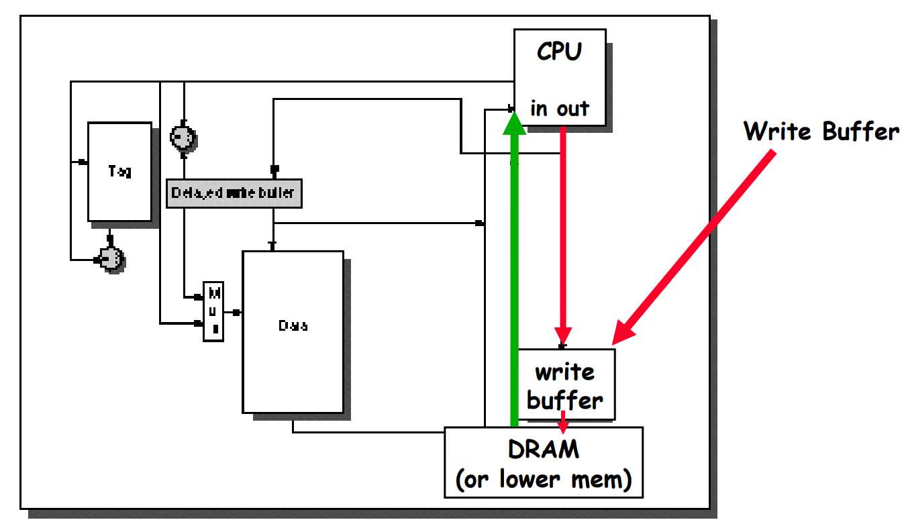

## Reduce the miss penalty

$AMAT_{cache} = T_{hit} + MissRate \cross T_{penalty}$

$AMAT_{mem} = T_{addressing} + T_{access} + T_{transfer}$

Write-through: all writes update cache and underlying memory/cache

- memory (or other processors) always have latest data
- Simpler management of cache

Write-back: all writes simply update cache

- much lower bandwidth, since data often overwritten multiple times
- Better tolerance to long-latency memory

#### Read Priority over Write on Miss

Add a write buffer between cache and memory.

If x is to be written on the block that y currently occupies, if $dirty(y) = 1$ (that means y has been changed but hasn't been written back), add y to write buffer so that x can be read earlier, rather than wait y to write back.

When cache miss happens, you should search data in write buffer before in MEM.

### Early Restart and Critical Word First

- Early restart: As soon as the requested word of the block  arrives, send it to the CPU and let the CPU continue execution

- Critical Word Firs: Request the missed word first from memory  and send it to the CPU as soon as it arrives; let the CPU continue execution while filling the rest of the words in the block. Also called wrapped fetch and requested word first
  - This optimization generally benefits caches with a large block size. The benefits of the Critical Word First optimization is a tradeoff between the size of the block and the likelihood of another access to a word within the block that has not yet been fetched. (from [Cache Optimization - Critical Word First and Early Restart - The Beard Sage](http://thebeardsage.com/cache-optimization-critical-word-first-and-early-restart/))

### Non-blocking Caches to reduce stalls on misses

Non-blocking cache or lockup-free cache allow data cache to continue to supply cache hits during a miss

- “hit under miss” reduces the effective miss penalty by working during miss
- “hit under multiple miss” or “miss under miss” may  further lower the effective miss penalty by  overlapping multiple misses
  - Requires multiple memory banks

### Add a second-level cache

L2 Equations:

- $AMAT = HitTime_{L1} + MissRate_{L1} \times MissPenalty_{L1}$
- $MissPenalty_{L1} = HitTime_{L2}+MissRate_{L2}*MissPenalty_{L2}$
- $AMAT = HitTime_{L1} + MissRate_{L1} \times (HitTime_{L2}+MissRate_{L2}*MissPenalty_{L2})$

Local miss rate: $MissRate_{L2} = \frac{\text{misses in L2}}{\text{total number of memory access to L2} }$

Global miss rate: $MissRate_{L1} \times MissRate_{L2} = \frac{\text{misses}}{\text{total number of memory access} }$

Global miss rate is what matters.

Inclusive and Exclusive:

- inclusive: $x \in L_1 \Rightarrow x \in L_2$
- exclusive: $x \in L_1 \Rightarrow x \not\in L_2, x \in L_2 \Rightarrow x \not\in L_1$
