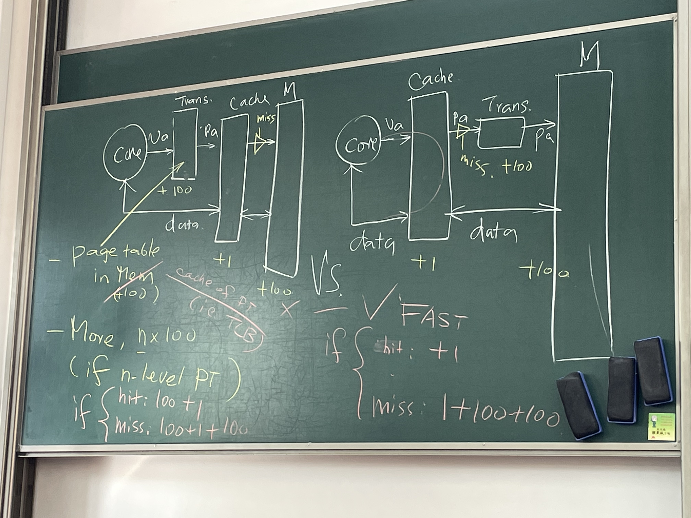
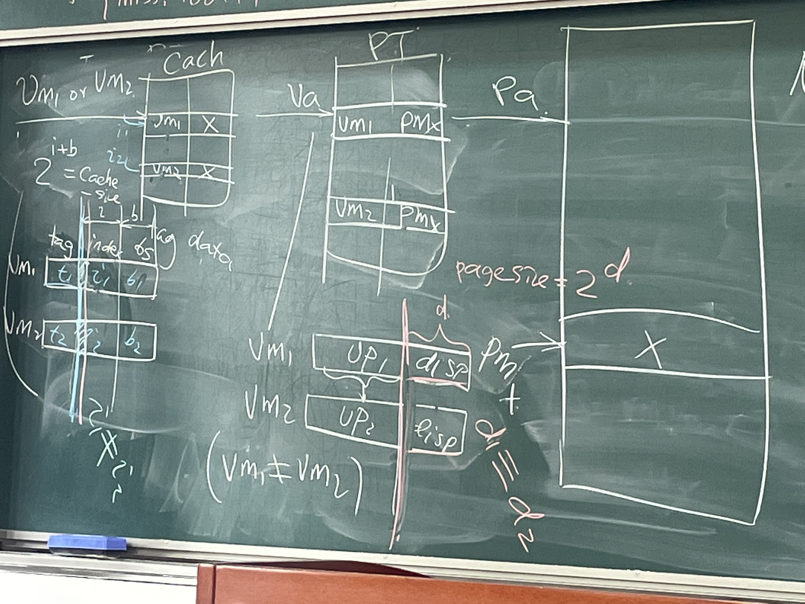

## Arch W8D2 notes

###### 陈永杉

### Cache

-virtual vs. physical

for after we adding the virtual memory into the archtecture, we need to add an interpretater unit into the structure.

##### question:

Shall we add the interpretater unit into between the cache and the core or between the cache and the memory?

for we need to search for the page information in the memory, so the cost of the interpretation will be about $n\times 100 circles$.

to optimize it, we can add a cache of PT $i.e. TLB$ (translation lookside Buffer), to backup the page info in it , to accelerate the interpretation time.

The cost of the two structures would be:

physical cache:

hit:100+1 circle;

miss: 100+1+100 circle (which less than 3%)

virtual cache:

hit: 1 circle;

miss:1+100+100 circle.

It's obvious that the virtual cache would be better.

Choosing virtual cache, we come up with:

##### question:

Synonymous/Alias

$\textbf{Q1}$ While we switch processes, for they has the same virtual address, we need to differ them.

one possible sulotion: add a process tag into it. (PID+tag)

another:  take the address into one mva, decided by the OS.

$\textbf{Q2}$ If two datas in one virtual cache were mapped into one phycial address, then there will be two backups of one data in the cache, which would cause the sameness question.

sulotion: .

1. go to 8K byte page size;

   in this way, the length of index is longer than the length of the page size, so two virtual address must be mapped into one same index.

2. go to 2 way set associative cache

   similar with the sulotion .

3. SoftWare (Compiler&OS) guarantee that VA[13]=PA[13].(force the highest bite same)

   we have  # order, which directly give orders to the compiler.

difference between malloc and mmap:

malloc ask for physical space, while mmap only want to insert a new address in the PT for already exist data.
