# W8D2 Notes

林田川  2022.11.2

## Cache (Continued)

### Physical Cache vs. Virtual Cache

Physical Cache: Indexed and tagged by Physical Address


Virtual Cache: Indexed and tagged by Virtual Address


时间比较：

假设页表储存在 Mem，页表查找延迟 (+100)，Mem 访问延迟 (+100)；Cache 延迟 (+1)

- Virtual Cache
  - hit: 100+1
  - miss: 100+1+100
- Physical Cache
  - hit: +1
  - miss: 1+100+100

从时间上看 Virtual Cache 更优。

### Virtual Cache 的问题

#### Synonymous

进程切换时页表切换，同一个虚地址在不同页表内对应不同的物理地址。

形式上：$x\in P_A$，$y\in P_B$，$x\neq y$ 但是 $vm(x)=vm(y)$

解决：在 tag 内额外记录进程 ID（tag' = PID + tag），称作 MVA（Modified Virtual Address）

#### Alias

多个虚地址指向同一个物理地址，但在 Cache 中存在多个副本，修改其中一个导致不协调。

形式上：$vm_1, vm_2\in \mathit{VM}$，$vm_1\neq vm_2$ 但是 $f(vm1)=f(vm2)=pm_x$

解决思路：避免同一个物理地址被放在 Cache 中的不同位置。

```plain
virtual address
               |<----d--->|
[   page no.   |   disp   ]

[    tag    | index | bs  ]
|<----t---->|<--i-->|<-b->|
cache
```

虚地址的后 $d$ 位与物理地址相同。

如果 $d \ge i+b$，那么同一个物理地址在 Cache 内的 $\mathit{index}$ 一定相同，就不会出现 alias 问题。要达到此目的有两种方法：

- 增大 $d$：bigger page size
- 减小 $i$：n-way set associative cache

除此之外，还可以在软件层面（编译器和操作系统）要求虚地址的后 $i+b$ 位均与物理地址相同，以达到同样的效果。

### TLB：页表的 cache

Translation Look-Aside Buffer (TLB)：保存最近使用的页表条目，加速地址翻译。

根据空间本地性，一般只要保存少数几个页表条目就有很好的效果。

对 Physical Cache 有很好的加速效果。


## Memory (Lec 4)

（时间不够没讲到）

### Organization
### Interface (Bus)
### Multi-Bank