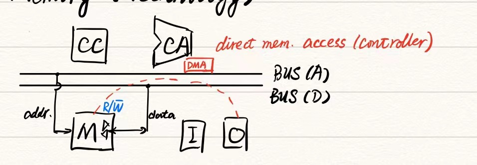
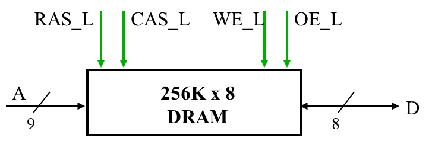
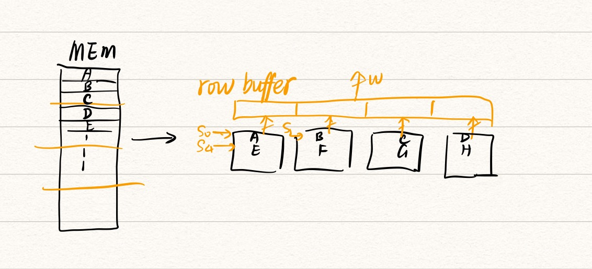

# W9D1: Memory Technology

> by Qijia Fan

General structure:

The main memory is only controlled by CPU (or by I/O with DMA).

## 1. SRAM

> CAAQA5 P97

- Static Random Access Memory
- Implement by transistors (晶体管) and typically use 6 transistors to store 1 bit.
- The structure is a **combinational logic circuit**, similar to the latch.
- No need to refresh.
- Usage: Cache

## 2. DRAM

> CAAQA5 P98

- Dynamic Random Access Memory
- Use one capacitor (电容) and transistor to store 1 bit.
- **Need to be refreshed** periodically to prevent losing information (leakage current of capacitors).
- Usage: Main Memory

### Some techniques to improve proformance

- FP-DRAM (Fast Page ...)

- EDO-DRAM (Extended Data Output ...)

- SDRAM (Synchronous  ...)

  > CAAQA5 P100
  >
  > 2 **banks** on chip, a clock signal to DRAM, transfer synchronous (同步) to system clock

- DDR DRAM (Double Data Rate  ...)

  > CAAQA5 P100
  >
  > transfer data on both rising and falling edge 

## 3. The organization of DRAM

- Every bank of DRAM is a 2D matrix and consists of several **rows**.

- Every DRAM access contains two stages (divide the address into 2 parts):

  

  1. RAS (Row Access Strobe, 行选通)
  2. CAS (Column Access Strobe, 列选通)

  > WE_L: write enable low
  >
  > OE_L: output enable low

- **Multi banks (组):** 

  
  
  - Break the memory into 2-8 blocks (块) that can operate independently.
  - Interleaved (交错) Memory

## 4. The performance of the main memory

- $AMAT_\text{mem} = T_\text{address} + T_\text{access} + T_\text{transfer and send data}$

- Assume that we want to send 4 words and $T_\text{addr.}=1, T_\text{access} = 6,T_\text{trans} = 1$, then

  - Simple Memory Performance: $=4\times(1+6+1)=32$
  - Wide Memory Performance: $=1 + 6 + 1=8$
  - Interleaved Memory Performance: $=1+6+4\times 1=11$

  > Interleaved memory performs better than the others when the word count increase and $ T_\text{access}$ is close to $\text{BlockNumber}\times T_\text{trans}$.

### Avoiding Bank Conflicts

- S/W: loop interchange or declaring array not power of 2
- H/W: Prime number of banks (in the following part?).

### Fast Bank Number and CRT

> will be introduced in the next class
