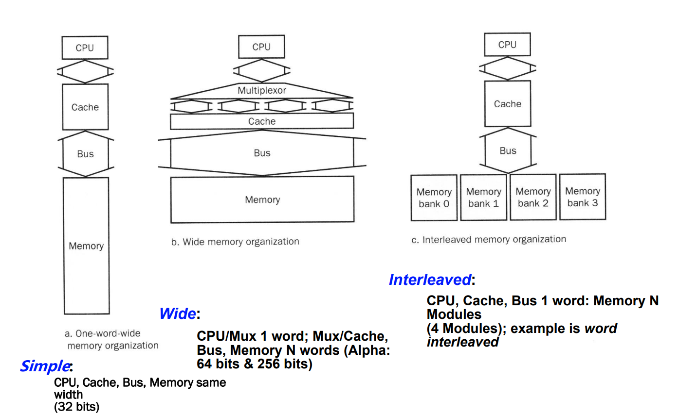
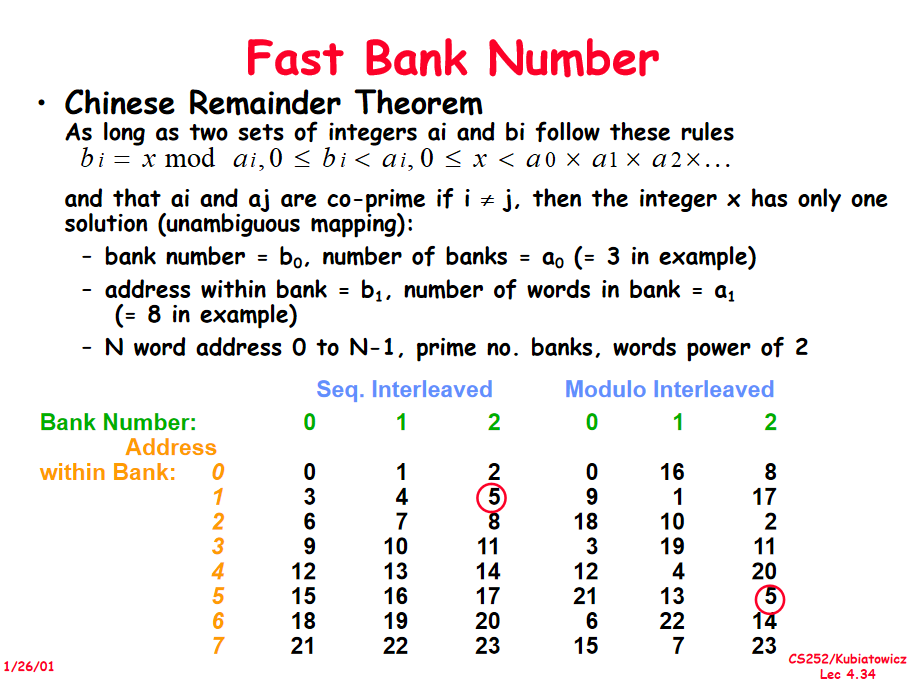

# Note: W9D1: 

> By ZhouBinglin

## 1.Main Memory Organization

三种 Organization 组织结构：

- Simple：
  - CPU, Cache, Bus, Memory same width (32 or 64 bits)

- Wide:
  - CPU: 1 word
  - Cache, Bus, Memory: n words (总线上能携带更多信息)
- Interleaved:
  - CPU, Cache, Bus 1 word
  - Memory N modus

## 2.Main Memory Performance

衡量memory速度的公式: $AMAT_{Mem} = T_{address} + T_{access} + T_{transfer}$ . 

对于三种不同的模型，假设 $T_{address} = 1$ ，$T_{access} = 6$ ，$T_{transfer} = 1$ . 读连续的 4 words data：

- Simple M.P.  $T=4\times(1 + 6 + 1) = 32$
- Wide M.P.(Bus is 4 words) $T = 1 + 6 + 1$
- Interleaved M.P. (4 bank) $T = 1 + 6 + 4\times1 = 11$

## 3.Multi Bnak

#### 概念：

存储器被组织为多个体(bank)

#### 目的：

在总线宽度不变的情况下，完成多个字的并行读写。加快访问速度。

速度变快的原因：多个字同时access到buffer里面，再一个一个地经总线传回到cpu。

本质是一种 **delay hidden** 策略：用多个word的回传时间掩盖掉第二次access的时间（注意：第二次access是从第一次access结束时开始的）。

所以我们能够得出结论： $\textbf{$Num_{bank}=T_{access}/T_{tansfer\_one\_word}$}$ 时 **delay hidden** 效果最好。从总线上看，此时word是连续不断地从mem回传。

#### Address 到 bank 的映射：

假设 $m-banks$ ，每个bank的capacity 为 $n$ words：

##### 1.高位交叉编址

$A = x\times n + y$ // $x$ 为bank的number，y为bank内offset

##### 2.低位交叉编址

$A = y \times m + x$ // $x$ 为bank的number，y为bank内offset

1，2相比低位交叉编址能够更好利用空间局部性，减少冲突率

tips：若用低位交叉编址发生bank冲突，可在编译器层面对代码进行优化。

##### 3.Gao.q.s : 快速交叉编址

$x = a \% m, y = a\%n$ 。但这要求 $n = 2^s, m = 2^k -1$  .

