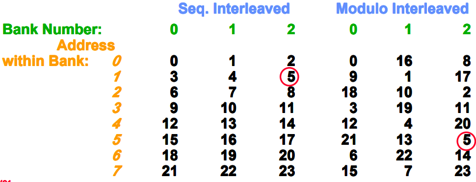
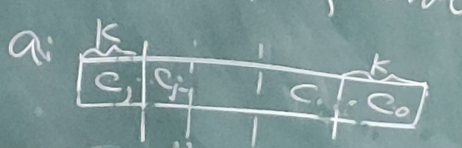

### Fast Bank Number

bank conflict can be decreased by module Interleaved.

$m$ and $l$ rows

left: $x_i = a_i \ mod \ m, y_i = \left[ \frac{a_i}{m} \right]$

right: $x_i = a_i \ mod \ m, y_i = a_i \ mod\ l$

let $l = 2^s, m = 2^k - 1$, then $y_i = a_i \ mod\ l = a_i >> s$ is easy to calculate.

notice that $\gcd(l, m) = 1$, so 

to simplify the calculation of $x_i, a_i = q (2 ^ k - 1) + x_i$ 

divide $a_i$ into $\frac{w}{k}$ blocks, then $a_i = \sum c_i \cdot 2^{ik} = \sum c_i \cdot ((2 ^ {k} - 1) + 1) ^ i \equiv \sum c_i (mod \ 2^k - 1)$, use cycle adder.

$110 + 100 \equiv 1010 \equiv 011(\mod 2^k - 1)$

